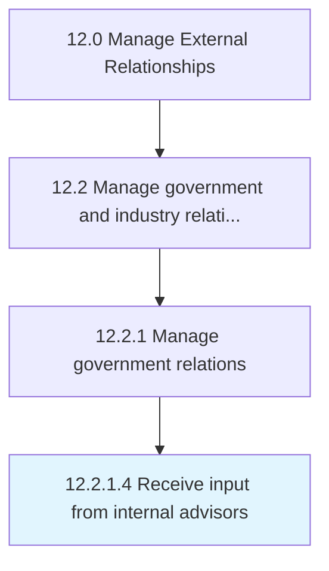
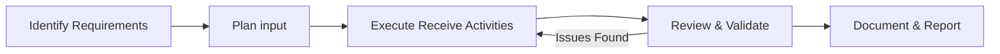
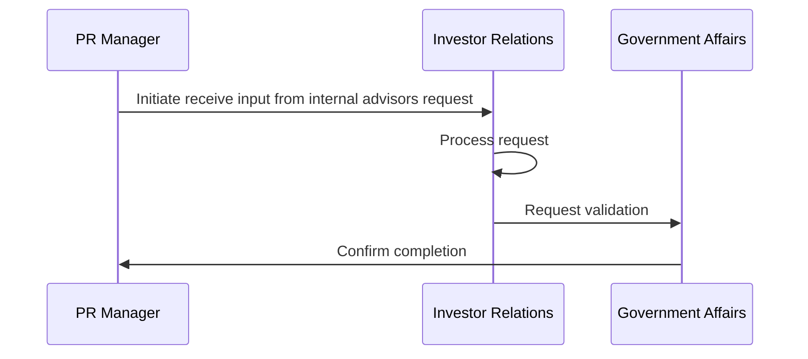

# Receive input from internal advisors

> Garnering internal advice from an informal group in order to successfully maintain and advance relationships.

## Overview

The receive input from internal advisors process is a critical component of the External Relationships function within an organization. It encompasses the systematic approach to receive input from internal advisors, ensuring that all activities are performed consistently, efficiently, and in alignment with organizational objectives. This process establishes the framework through which receive input from internal advisors is executed, monitored, and continuously improved to deliver value across the enterprise.

Within the APQC Process Classification Framework (hierarchy 12.2.1.4), this activity supports the broader "Manage External Relationships" category. Effective execution requires cross-functional collaboration, clear accountability, and robust governance mechanisms. Organizations that mature this process typically see improved operational performance, reduced risk exposure, and stronger alignment between tactical activities and strategic goals.


## Process Hierarchy



## Key Statistics

| Metric | Value |
|--------|-------|
| APQC Code | 12872 |
| Hierarchy ID | 12.2.1.4 |
| Level | Activity |
| Parent | [12.2.1](../) |
| Sub-Processes | 0 |


## GraphDL Semantic Structure

```graphdl
receive.Input.from.InternalAdvisors
```

| Component | Value | Description |
|-----------|-------|-------------|
| Verb | `receive` | Primary action |
| Object | `input` | Direct object |
| Preposition | `from` | Relationship |
| PrepObject | `internal advisors` | Indirect object |


## Process Flow




## Process Sequence


## RACI Matrix

| Activity | Manager | Specialist | Manager | Director |
|----------|------|------|------|------|
| Planning & Scoping | R | A | C | I |
| Execution | A | C | I | R |
| Review & Approval | C | I | R | A |
| Reporting | I | R | A | C |

## Related Occupations

- [Government Relations Manager](/occupations/GovernmentRelationsManager)
- [Public Relations Specialist](/occupations/PublicRelationsSpecialist)
- [Community Relations Manager](/occupations/CommunityRelationsManager)
- [Investor Relations Director](/occupations/InvestorRelationsDirector)

## Related Departments

- Corporate Affairs
- Public Relations
- Government Relations

## Industry Variations

### Pharmaceutical

Regulatory agency engagement (FDA, EMA), patient advocacy group relationships, and healthcare provider communication programs.

### Banking

Regulatory body relationships (OCC, FDIC), community reinvestment obligations, and shareholder communication requirements.

### Technology

Open-source community engagement, developer relations programs, industry consortium participation, and standards body involvement.

## KPIs & Metrics

| KPI | Target | Measurement Frequency |
|-----|--------|----------------------|
| Stakeholder Satisfaction Score | > 4.0/5.0 | Annually |
| Regulatory Response Time | < 48 hours | Per Inquiry |
| Community Engagement Events | > 12/year | Quarterly |
| Media Sentiment Score | Positive trend | Monthly |

## Related Concepts

- Input
- InternalAdvisors


---

*Source: APQC PCF 12872 (12.2.1.4) - APQC*
