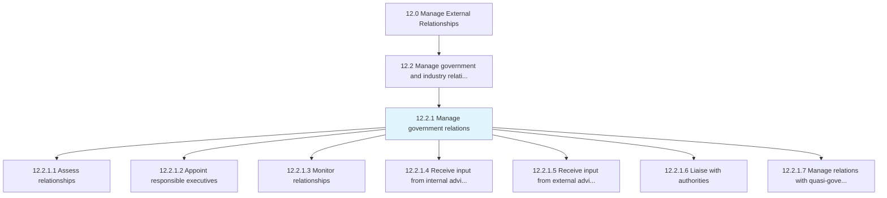
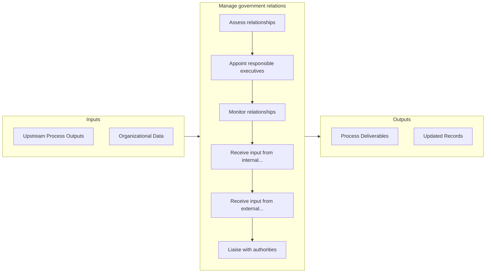

# Manage government relations

> Persuading public and government policy at the local, regional, national, and global level (subject to government regulations).

## Overview

Process 12.2.1 is a core process that defines the specific procedures for manage government relations. 

Persuading public and government policy at the local, regional, national, and global level (subject to government regulations).

## Process Hierarchy



## Key Statistics

| Metric | Value |
|--------|-------|
| APQC Code | 11038 |
| Hierarchy ID | 12.2.1 |
| Level | Process |
| Parent | [12.2](../) |
| Sub-Processes | 7 |


## GraphDL Semantic Structure

```
manage.GovernmentRelations
```

| Component | Value | Description |
|-----------|-------|-------------|
| Verb | `manage` | Primary action |
| Object | `government relations` | Direct object |


## Process Flow



## Sub-Processes

| Process | Hierarchy ID | Description |
|---------|-------------|-------------|
| [Assess relationships](./AssessRelationships) | 12.2.1.1 | Ascertaining how the business entity relates to all levels of government |
| [Appoint responsible executives](./AppointResponsibleExecutives) | 12.2.1.2 | Assigning executive level resources to manage, grow, and drive relationships with government bodies |
| [Monitor relationships](./MonitorRelationships) | 12.2.1.3 | Analyzing current relationships with government bodies and entities |
| [Receive input from internal advisors](./ReceiveInputFromInternalAdvisors) | 12.2.1.4 | Garnering internal advice from an informal group in order to successfully maintain and advance relat |
| [Receive input from external advisors](./ReceiveInputFromExternalAdvisors) | 12.2.1.5 | Garnering third party advice from an informal group in order to successfully maintain and advance re |
| [Liaise with authorities](./LiaiseWithAuthorities) | 12.2.1.6 | Meeting with government heads and representatives |
| [Manage relations with quasi-government bodies](./ManageRelationsWithQuasigovernmentBodies) | 12.2.1.7 | Managing relations with quasi-governmental organizations, corporations, businesses, or any other age |


## Related Concepts

- [GovernmentRelations](/concepts/GovernmentRelations)


---

*Source: APQC PCF 11038 (12.2.1) - APQC*
