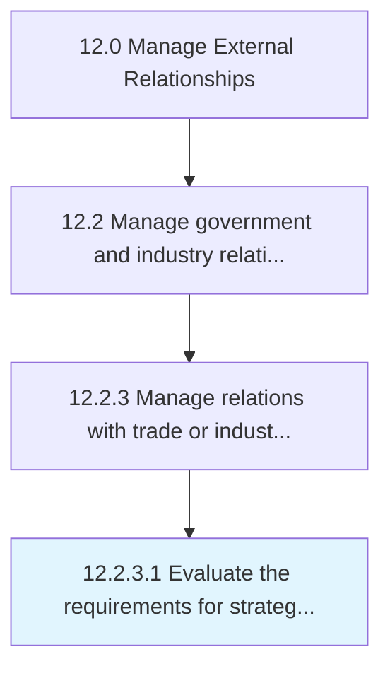

# Evaluate the requirements for strategic relationships

> Determining the requirements to enter in to an agreement with trade or industry agencies.

## Overview

Activity 12.2.3.1 is an activity within the Manage External Relationships framework. 

Determining the requirements to enter in to an agreement with trade or industry agencies. Discover what activities or processes can be conducted to provide the best mutual outcome.

## Process Hierarchy



## Key Statistics

| Metric | Value |
|--------|-------|
| APQC Code | 12879 |
| Hierarchy ID | 12.2.3.1 |
| Level | Activity |
| Parent | [12.2.3](../) |
| Sub-Processes | 0 |


## GraphDL Semantic Structure

```
evaluate.TheRequirements.for.StrategicRelationships
```

| Component | Value | Description |
|-----------|-------|-------------|
| Verb | `evaluate` | Primary action |
| Object | `the requirements` | Direct object |
| Preposition | `for` | Relationship |
| PrepObject | `strategic relationships` | Indirect object |


## Related Concepts

- Requirements
- StrategicRelationships


---

*Source: APQC PCF 12879 (12.2.3.1) - APQC*
