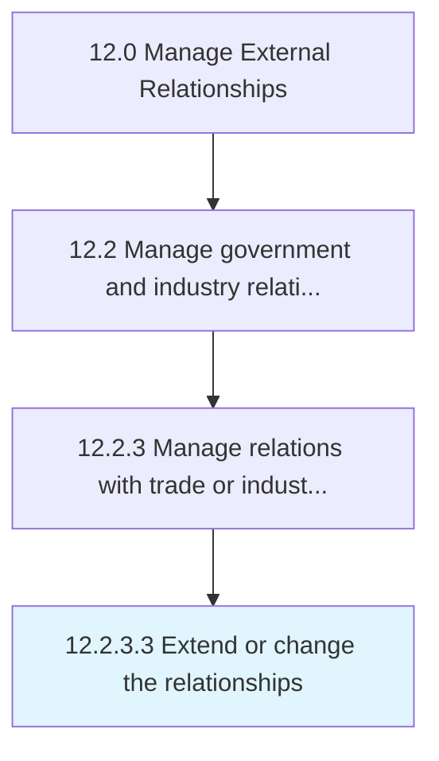

# Extend or change the relationships

> Providing additional information or inclusion for third party trade or industry entities; or changing existing parameters to modify the current relationship.

## Overview

Activity 12.2.3.3 is an activity within the Manage External Relationships framework. 

Providing additional information or inclusion for third party trade or industry entities; or changing existing parameters to modify the current relationship. Communicate and execute changes.

## Process Hierarchy



## Key Statistics

| Metric | Value |
|--------|-------|
| APQC Code | 12881 |
| Hierarchy ID | 12.2.3.3 |
| Level | Activity |
| Parent | [12.2.3](../) |
| Sub-Processes | 0 |


## GraphDL Semantic Structure

```
extend.OrChangeTheRelationships
```

| Component | Value | Description |
|-----------|-------|-------------|
| Verb | `extend` | Primary action |
| Object | `or change the relationships` | Direct object |


## Related Concepts

- [Relationships](/concepts/Relationships)
- [Relationships](/concepts/Relationships)


---

*Source: APQC PCF 12881 (12.2.3.3) - APQC*
