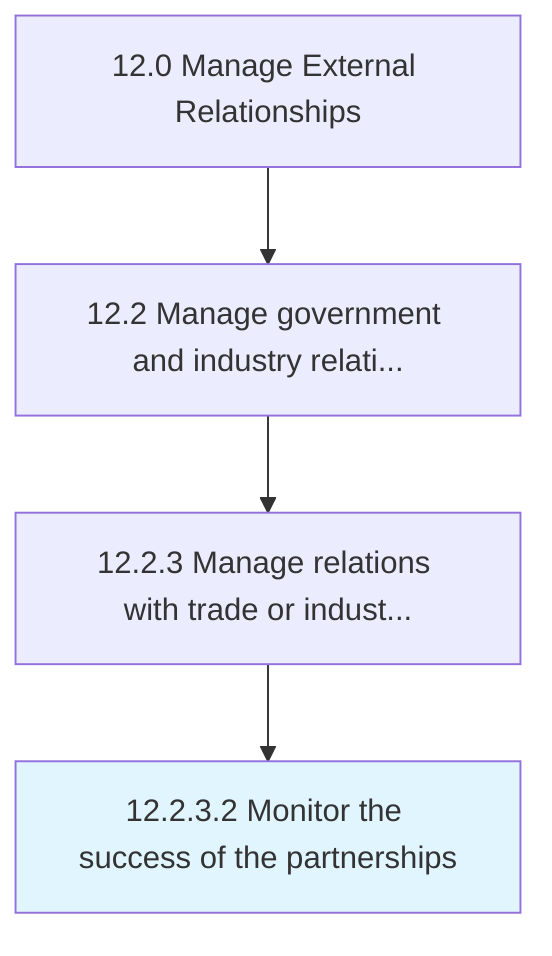

# Monitor the success of the partnerships

> Analyzing current relationships with trade and industry groups.

## Overview

Activity 12.2.3.2 is an activity within the Manage External Relationships framework. 

Analyzing current relationships with trade and industry groups. Ensure that the partnership in successful and make modifications where needed.

## Process Hierarchy



## Key Statistics

| Metric | Value |
|--------|-------|
| APQC Code | 12880 |
| Hierarchy ID | 12.2.3.2 |
| Level | Activity |
| Parent | [12.2.3](../) |
| Sub-Processes | 0 |


## GraphDL Semantic Structure

```
monitor.TheSuccess.of.ThePartnerships
```

| Component | Value | Description |
|-----------|-------|-------------|
| Verb | `monitor` | Primary action |
| Object | `the success` | Direct object |
| Preposition | `of` | Relationship |
| PrepObject | `the partnerships` | Indirect object |


## Related Concepts

- [Success](/concepts/Success)
- [Partnerships](/concepts/Partnerships)


---

*Source: APQC PCF 12880 (12.2.3.2) - APQC*
