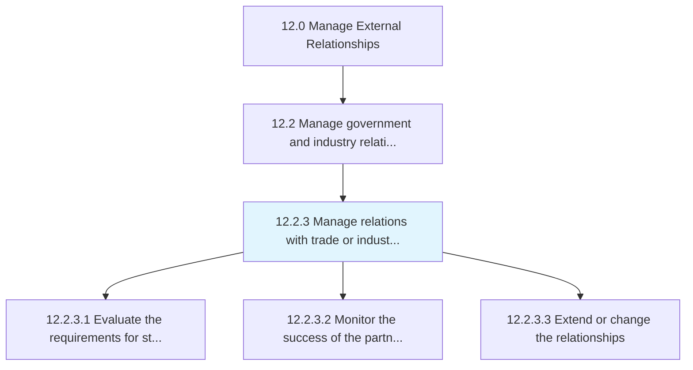
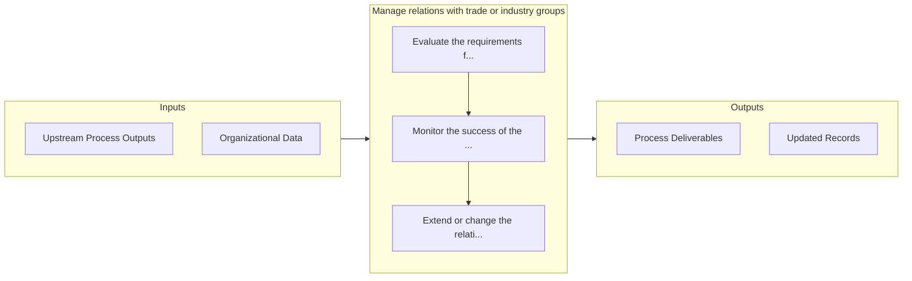

# Manage relations with trade or industry groups

> Managing relations with organizations established and financed by businesses that operate in a specific industry.

## Overview

Process 12.2.3 is a core process that defines the specific procedures for manage relations with trade or industry groups. 

Managing relations with organizations established and financed by businesses that operate in a specific industry. Participate in public relations actions such as lobbying and publishing, advertising, education, and political donations.

## Process Hierarchy



## Key Statistics

| Metric | Value |
|--------|-------|
| APQC Code | 11040 |
| Hierarchy ID | 12.2.3 |
| Level | Process |
| Parent | [12.2](../) |
| Sub-Processes | 3 |


## GraphDL Semantic Structure

```graphdl
manage.Relations.with.TradeOrIndustryGroups
```

| Component | Value | Description |
|-----------|-------|-------------|
| Verb | `manage` | Primary action |
| Object | `relations` | Direct object |
| Preposition | `with` | Relationship |
| PrepObject | `trade or industry groups` | Indirect object |


## Process Flow



## Sub-Processes

| Process | Hierarchy ID | Description |
|---------|-------------|-------------|
| [Evaluate the requirements for strategic relationships](./EvaluateTheRequirementsForStrategicRelationships) | 12.2.3.1 | Determining the requirements to enter in to an agreement with trade or industry agencies |
| [Monitor the success of the partnerships](./MonitorTheSuccessOfThePartnerships) | 12.2.3.2 | Analyzing current relationships with trade and industry groups |
| [Extend or change the relationships](./ExtendOrChangeTheRelationships) | 12.2.3.3 | Providing additional information or inclusion for third party trade or industry entities; or changin |


## Related Concepts

- Relations
- TradeGroups
- Relations
- IndustryGroups


---

*Source: APQC PCF 11040 (12.2.3) - APQC*
