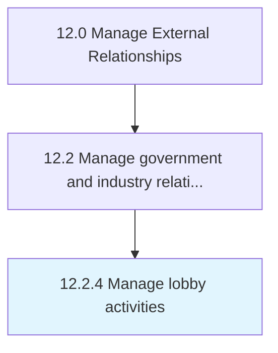

# Manage lobby activities

> Managing lobbying activities to affect government policies.

## Overview

Process 12.2.4 is a core process that defines the specific procedures for manage lobby activities. 

Managing lobbying activities to affect government policies.

## Process Hierarchy



## Key Statistics

| Metric | Value |
|--------|-------|
| APQC Code | 11041 |
| Hierarchy ID | 12.2.4 |
| Level | Process |
| Parent | [12.2](../) |
| Sub-Processes | 0 |


## GraphDL Semantic Structure

```
manage.LobbyActivities
```

| Component | Value | Description |
|-----------|-------|-------------|
| Verb | `manage` | Primary action |
| Object | `lobby activities` | Direct object |


## Related Concepts

- [LobbyActivities](/concepts/LobbyActivities)


---

*Source: APQC PCF 11041 (12.2.4) - APQC*
