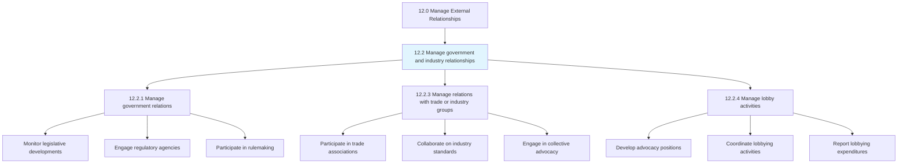
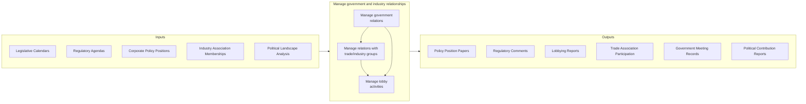
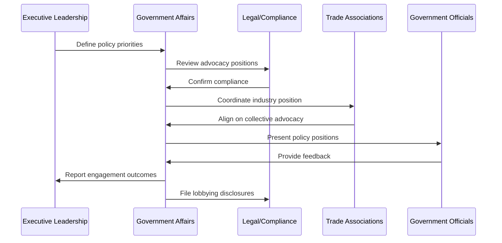
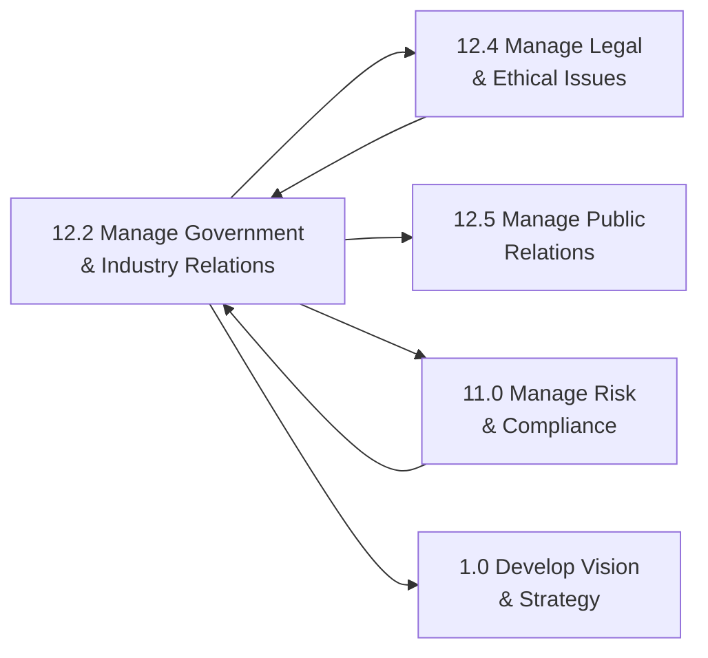

# Manage government and industry relationships

> Creating and maintaining relationships with government and industry representatives.

## Overview

Group 12.2 is a process group within APQC Category 12.0 (Manage External Relationships).

Managing government and industry relationships is a strategic function that enables organizations to navigate complex regulatory environments, influence policy development, and collaborate with industry peers on matters of common interest. This process group encompasses activities ranging from engaging with elected officials and regulatory agencies to participating in trade associations and managing lobbying efforts.

Effective government relations helps organizations anticipate regulatory changes, participate constructively in policy development, and ensure their perspectives are represented in legislative and regulatory processes. Industry relationships through trade associations and peer networks provide opportunities for collective advocacy, standard-setting, and sharing best practices.

Organizations with mature government affairs capabilities demonstrate better regulatory compliance outcomes, earlier awareness of policy changes, and stronger positioning on issues affecting their industry. This function is particularly critical in heavily regulated industries such as healthcare, financial services, energy, and telecommunications.

## Process Hierarchy



## Key Statistics

| Metric | Value |
|--------|-------|
| APQC Code | 11011 |
| Hierarchy ID | 12.2 |
| Level | Group |
| Parent | [12.0 Manage External Relationships](../) |
| Sub-Processes | 3 |
| Industry Applicability | All industries, critical for regulated sectors |


## GraphDL Semantic Structure

```graphdl
manage.GovernmentAndIndustryRelationships
```

| Component | Value | Description |
|-----------|-------|-------------|
| Verb | `manage` | Primary action - ongoing oversight and coordination |
| Object | `government and industry relationships` | Direct object - dual stakeholder categories |


## Process Flow



## Sub-Processes

| Process | Hierarchy ID | Description |
|---------|-------------|-------------|
| [Manage government relations](./12.2.1-ManageGovernmentRelations/) | 12.2.1 | Persuading public and government policy at the local, regional, national, and global levels. Includes monitoring legislation, engaging with regulatory agencies, participating in public comment processes, and building relationships with elected officials and their staff. |
| [Manage relations with trade or industry groups](./12.2.3-ManageRelationsTradeIndustry/) | 12.2.3 | Managing relations with organizations established and financed by businesses operating in specific industries. Includes participating in trade associations, collaborating on industry standards, and coordinating collective advocacy efforts. |
| [Manage lobby activities](./ManageLobbyActivities) | 12.2.4 | Managing lobbying activities to affect government policies in alignment with corporate interests. Includes developing advocacy strategies, coordinating with lobbyists, and ensuring compliance with lobbying disclosure requirements. |

## Activity Sequence



## RACI Matrix

| Activity | Government Affairs | CEO | Legal Counsel | External Lobbyists | Trade Associations | Board |
|----------|-------------------|-----|---------------|-------------------|-------------------|-------|
| Develop policy positions | R | A | C | C | C | I |
| Monitor legislation | R | I | C | C | C | I |
| Engage regulatory agencies | R | A | C | C | I | I |
| Participate in trade associations | R | A | I | I | C | I |
| Coordinate lobbying activities | R | A | A | R | C | I |
| File lobbying disclosures | R | I | A | C | I | I |
| Manage PAC activities | R | A | A | I | I | C |
| Build government relationships | R | A | C | R | I | I |
| Respond to regulatory inquiries | R | C | A | C | I | I |
| Develop grassroots campaigns | R | A | C | C | C | I |

**Legend:** R = Responsible, A = Accountable, C = Consulted, I = Informed

## Metrics and KPIs

### Effectiveness Metrics

| Metric | Description | Target Range |
|--------|-------------|--------------|
| Legislative success rate | Percentage of priority issues with favorable outcomes | 60%+ on priority issues |
| Regulatory engagement | Number of comment letters and regulatory meetings | Active participation on key rules |
| Policy awareness lead time | Days of advance notice on regulatory changes | 90+ days on major changes |
| Relationship quality | Assessment of key government relationships | Strong relationships with key officials |
| Industry influence | Leadership roles in trade associations | Active committee participation |

### Efficiency Metrics

| Metric | Description | Target Range |
|--------|-------------|--------------|
| Cost per advocacy initiative | Total government affairs spend per priority issue | Optimize over time |
| Response time to regulatory changes | Days to develop and file comments | Within comment period deadlines |
| Meeting utilization | Productive outcomes from government meetings | High-value engagement focus |
| Disclosure compliance | Timely and accurate lobbying reports | 100% compliance |

### Outcome Metrics

| Metric | Description | Target Range |
|--------|-------------|--------------|
| Regulatory burden impact | Effect of regulations on operations | Manageable compliance costs |
| Policy alignment | Degree of alignment between policy outcomes and corporate interests | Favorable on priority issues |
| Industry standard influence | Contribution to industry standards | Active participation in standard-setting |
| Reputation with regulators | Standing with key regulatory agencies | Positive, constructive relationship |

## Related Departments and Occupations

### Primary Departments

| Department | Role in Process |
|------------|-----------------|
| Government Affairs | Primary owner of government relations and lobbying activities |
| Legal/Compliance | Ensures compliance with lobbying laws and regulations |
| Executive Office | Sets policy priorities and participates in high-level engagement |
| Public Affairs | Coordinates grassroots and public advocacy efforts |
| Regulatory Affairs | Manages ongoing regulatory relationships in specialized areas |

### Key Occupations

| Occupation | Responsibilities |
|------------|------------------|
| Vice President, Government Affairs | Leads government relations strategy and team |
| Government Relations Manager | Manages day-to-day legislative and regulatory engagement |
| Regulatory Affairs Specialist | Focuses on agency relationships and rulemaking |
| Lobbyist (Internal/External) | Conducts direct advocacy with government officials |
| Trade Association Executive | Coordinates collective industry advocacy |
| PAC Administrator | Manages political action committee activities |

## Industry Variations

### Healthcare and Life Sciences

Healthcare organizations face extensive regulatory oversight from FDA, CMS, and state health departments. Government relations focuses on drug approvals, reimbursement policies, and healthcare reform legislation.

**Industry-Specific Activities:**
- Manage FDA interactions
- Advocate on reimbursement policies
- Engage on healthcare reform legislation
- Participate in clinical practice guideline development

### Financial Services

Banks and financial institutions navigate complex regulatory frameworks from multiple agencies including the Federal Reserve, OCC, FDIC, and CFPB. Government relations addresses capital requirements, consumer protection, and systemic risk regulations.

**Industry-Specific Activities:**
- Engage with prudential regulators
- Advocate on capital and liquidity requirements
- Participate in international regulatory coordination
- Address consumer protection regulations

### Energy and Utilities

Energy companies manage relationships with FERC, EPA, state utility commissions, and environmental agencies. Government relations addresses energy policy, environmental regulations, and infrastructure permitting.

**Industry-Specific Activities:**
- Advocate on energy policy
- Engage on environmental regulations
- Navigate permitting processes
- Address rate-setting proceedings

### Technology

Technology companies engage on data privacy, antitrust, content moderation, and international trade issues. Government relations increasingly addresses platform regulation and AI governance.

**Industry-Specific Activities:**
- Advocate on privacy legislation
- Engage on antitrust matters
- Address content moderation policies
- Navigate international data transfer rules

## Related Processes



## Related Concepts

- GovernmentRelationships
- IndustryRelationships
- RegulatoryAffairs
- Lobbying
- TradeAssociations
- PublicPolicy
- PoliticalEngagement


---

*Source: APQC PCF 11011 (12.2) - APQC*
