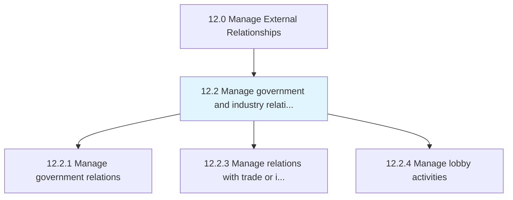
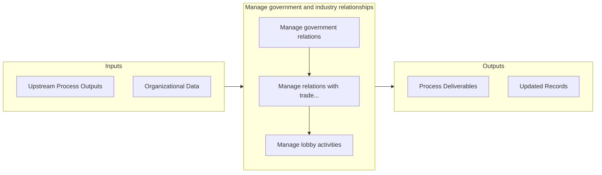

# Manage government and industry relationships

> Creating and maintaining relationships with government and industry representatives.

## Overview

Group 12.2 is a process group within APQC Category 12.0 (Manage External Relationships). 

Creating and maintaining relationships with government and industry representatives.

## Process Hierarchy



## Key Statistics

| Metric | Value |
|--------|-------|
| APQC Code | 11011 |
| Hierarchy ID | 12.2 |
| Level | Group |
| Parent | [12](../) |
| Sub-Processes | 3 |


## GraphDL Semantic Structure

```
manage.GovernmentAndIndustryRelationships
```

| Component | Value | Description |
|-----------|-------|-------------|
| Verb | `manage` | Primary action |
| Object | `government and industry relationships` | Direct object |


## Process Flow



## Sub-Processes

| Process | Hierarchy ID | Description |
|---------|-------------|-------------|
| [Manage government relations](./12.2.1-ManageGovernmentRelations/) | 12.2.1 | Persuading public and government policy at the local, regional, national, and global level (subject  |
| [Manage relations with trade or industry groups](./12.2.3-ManageRelationsTradeIndustry/) | 12.2.3 | Managing relations with organizations established and financed by businesses that operate in a speci |
| [Manage lobby activities](./ManageLobbyActivities) | 12.2.4 | Managing lobbying activities to affect government policies |


## Related Concepts

- [GovernmentRelationships](/concepts/GovernmentRelationships)
- [IndustryRelationships](/concepts/IndustryRelationships)


---

*Source: APQC PCF 11011 (12.2) - APQC*
