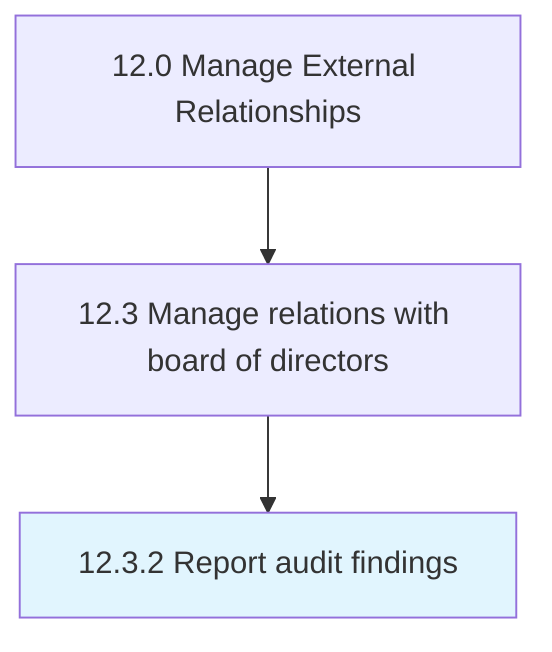

# Report audit findings

> Reporting audit findings to management.

## Overview

Process 12.3.2 is a core process that defines the specific procedures for report audit findings. 

Reporting audit findings to management. Practice an internal audit with criteria for confirming a problem, a description of the situation, and the root cause of the problem. Make recommendations that resolve the issue.

## Process Hierarchy



## Key Statistics

| Metric | Value |
|--------|-------|
| APQC Code | 11043 |
| Hierarchy ID | 12.3.2 |
| Level | Process |
| Parent | [12.3](../) |
| Sub-Processes | 0 |


## GraphDL Semantic Structure

```
report.AuditFindings
```

| Component | Value | Description |
|-----------|-------|-------------|
| Verb | `report` | Primary action |
| Object | `audit findings` | Direct object |


## Related Concepts

- [AuditFindings](/concepts/AuditFindings)


---

*Source: APQC PCF 11043 (12.3.2) - APQC*
