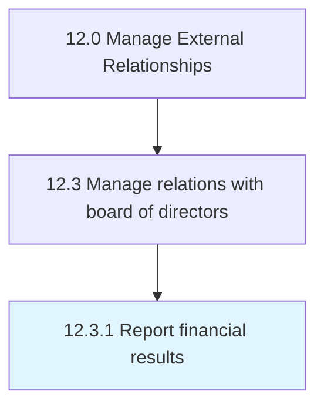

# Report financial results

> Reporting financial results to management, and releasing results to the public.

## Overview

Process 12.3.1 is a core process that defines the specific procedures for report financial results. 

Reporting financial results to management, and releasing results to the public. Report financial statements, including the income statement, balance sheet, and statement of cash flows.

## Process Hierarchy



## Key Statistics

| Metric | Value |
|--------|-------|
| APQC Code | 11042 |
| Hierarchy ID | 12.3.1 |
| Level | Process |
| Parent | [12.3](../) |
| Sub-Processes | 0 |


## GraphDL Semantic Structure

```
report.FinancialResults
```

| Component | Value | Description |
|-----------|-------|-------------|
| Verb | `report` | Primary action |
| Object | `financial results` | Direct object |


## Related Concepts

- FinancialResults


---

*Source: APQC PCF 11042 (12.3.1) - APQC*
