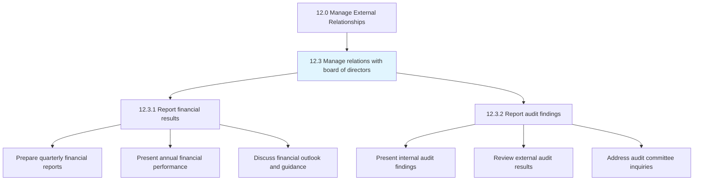
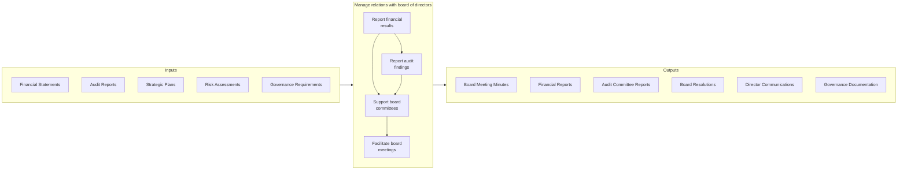
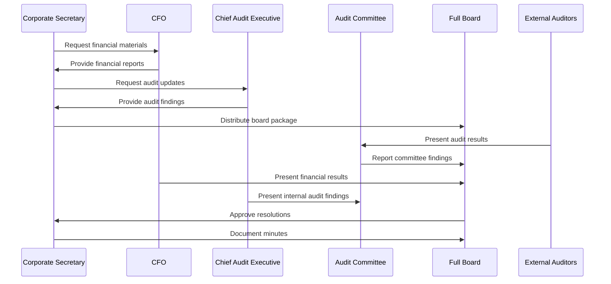
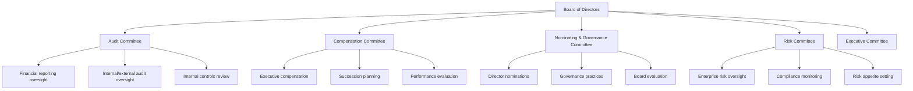
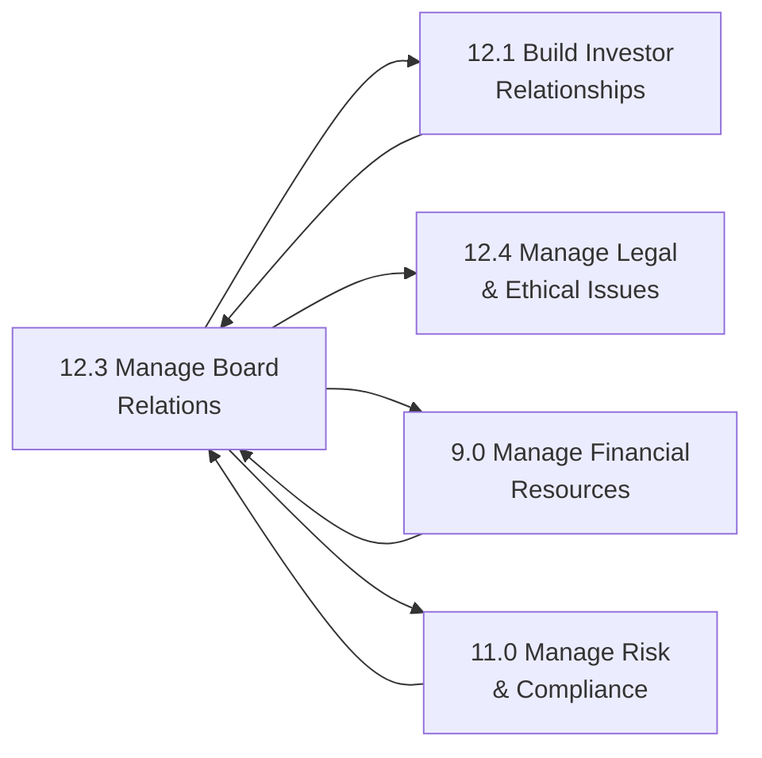

# Manage relations with board of directors

> Maintaining relations with representatives of the stockholders.

## Overview

Group 12.3 is a process group within APQC Category 12.0 (Manage External Relationships).

Managing relations with the board of directors is a critical governance function that ensures effective communication and collaboration between corporate management and the representatives of shareholders. The board of directors serves as the primary oversight body for corporate strategy, risk management, executive compensation, and major business decisions.

This process group encompasses establishing and maintaining the communication channels, reporting mechanisms, and working relationships that enable the board to fulfill its fiduciary duties. Effective board relations require transparent financial reporting, timely communication of material developments, and facilitation of board committees including audit, compensation, nominating/governance, and risk committees.

Organizations with strong board relations demonstrate better corporate governance, more informed decision-making at the board level, and enhanced stakeholder confidence. The corporate secretary function typically serves as the primary liaison between management and the board, ensuring proper meeting protocols, documentation, and follow-through on board directives.

Key activities include preparing board meeting materials, coordinating committee meetings, managing director onboarding and education, facilitating board evaluations, and ensuring compliance with governance requirements.

## Process Hierarchy



## Key Statistics

| Metric | Value |
|--------|-------|
| APQC Code | 11012 |
| Hierarchy ID | 12.3 |
| Level | Group |
| Parent | [12.0 Manage External Relationships](../) |
| Sub-Processes | 2 |
| Industry Applicability | All organizations with boards of directors |


## GraphDL Semantic Structure

```graphdl
manage.Relations.with.BoardOfDirectors
```

| Component | Value | Description |
|-----------|-------|-------------|
| Verb | `manage` | Primary action - ongoing coordination and oversight |
| Object | `relations` | Direct object - the relationship being maintained |
| Preposition | `with` | Relationship type - indicates counterparty |
| PrepObject | `board of directors` | Indirect object - the stakeholder group |


## Process Flow



## Sub-Processes

| Process | Hierarchy ID | Description |
|---------|-------------|-------------|
| [Report financial results](./ReportFinancialResults) | 12.3.1 | Reporting financial results to the board of directors and management, including preparation of quarterly and annual financial presentations, discussion of variances to plan and prior periods, and communication of financial outlook and guidance. This includes both routine reporting and ad-hoc updates on material financial developments. |
| [Report audit findings](./ReportAuditFindings) | 12.3.2 | Reporting internal and external audit findings to the board and audit committee. Includes presenting internal audit results, reviewing external auditor findings, discussing management responses to audit observations, and addressing audit committee inquiries on control effectiveness and remediation efforts. |

## Activity Sequence



## RACI Matrix

| Activity | Corporate Secretary | CEO | CFO | Chief Audit Executive | External Auditors | Board Chair |
|----------|--------------------|----|-----|----------------------|-------------------|-------------|
| Prepare board meeting agendas | R | A | C | C | I | A |
| Compile board packages | R | A | C | C | I | I |
| Report financial results | C | A | R | I | C | I |
| Report internal audit findings | C | I | C | R | I | I |
| Report external audit findings | C | I | C | C | R | I |
| Facilitate board meetings | R | C | C | I | I | A |
| Document board minutes | R | I | I | I | I | A |
| Manage director communications | R | A | I | I | I | C |
| Coordinate committee meetings | R | I | C | C | C | C |
| Support director onboarding | R | A | C | C | I | C |
| Facilitate board evaluations | R | A | I | I | I | A |
| Ensure governance compliance | R | A | C | C | I | C |

**Legend:** R = Responsible, A = Accountable, C = Consulted, I = Informed

## Board Committee Structure



## Metrics and KPIs

### Effectiveness Metrics

| Metric | Description | Target Range |
|--------|-------------|--------------|
| Board meeting attendance | Average director attendance rate | 95%+ attendance |
| Committee meeting effectiveness | Director satisfaction with meeting quality | High satisfaction scores |
| Information timeliness | Days before meeting materials distributed | 5-7 days in advance |
| Board engagement | Director participation in discussions | Active engagement from all directors |
| Governance rating | External governance assessment scores | Top quartile ratings |

### Efficiency Metrics

| Metric | Description | Target Range |
|--------|-------------|--------------|
| Meeting preparation time | Hours to prepare board packages | Optimize over time |
| Administrative cost per meeting | Total cost of board meeting support | Benchmark against peers |
| Resolution cycle time | Days to implement board decisions | Timely implementation |
| Communication response time | Time to respond to director inquiries | Within 24 hours |

### Outcome Metrics

| Metric | Description | Target Range |
|--------|-------------|--------------|
| Board turnover | Annual director departure rate | Healthy turnover (10-15%) |
| Director satisfaction | Annual director feedback scores | High satisfaction |
| Governance incidents | Number of governance-related issues | Zero material incidents |
| Regulatory compliance | Compliance with governance requirements | 100% compliance |
| Shareholder support | Proxy vote outcomes on governance matters | 80%+ support |

## Related Departments and Occupations

### Primary Departments

| Department | Role in Process |
|------------|-----------------|
| Corporate Secretary Office | Primary owner of board relations and governance |
| Finance | Provides financial reporting to the board |
| Internal Audit | Reports audit findings to the audit committee |
| Legal | Advises on governance and compliance matters |
| Executive Office | Sets strategic agenda and leads board engagement |

### Key Occupations

| Occupation | Responsibilities |
|------------|------------------|
| Corporate Secretary | Manages all board administration and governance |
| Chief Executive Officer | Primary management interface with the board |
| Chief Financial Officer | Reports financial results to the board |
| Chief Audit Executive | Reports internal audit findings to audit committee |
| General Counsel | Advises on legal and governance matters |
| Board Chair | Leads board meetings and sets governance tone |

## Board Calendar and Cadence

| Meeting Type | Frequency | Primary Focus |
|--------------|-----------|---------------|
| Full Board Meeting | Quarterly | Strategy, financial results, major decisions |
| Audit Committee | Quarterly | Financial reporting, internal controls, audits |
| Compensation Committee | Quarterly | Executive compensation, performance, succession |
| Nominating/Governance | Semi-annually | Director nominations, governance practices |
| Risk Committee | Quarterly | Enterprise risk, compliance, emerging risks |
| Annual Meeting | Annually | Shareholder proposals, director elections |
| Strategy Session | Annually | Long-term strategic planning |

## Industry Variations

### Public Companies

Public company boards have extensive regulatory requirements including SEC rules, stock exchange listing standards, and SOX compliance. Board relations must address proxy disclosures, say-on-pay votes, and shareholder activism.

**Industry-Specific Activities:**
- Manage proxy statement preparation
- Address shareholder proposals
- Ensure SEC compliance
- Navigate stock exchange requirements

### Financial Services

Banks and financial institutions have specialized board requirements including regulatory expectations for board oversight of risk, compliance, and capital management.

**Industry-Specific Activities:**
- Report on regulatory examinations
- Oversee risk appetite frameworks
- Monitor capital adequacy
- Address BSA/AML compliance

### Private Companies

Private company boards may have different compositions including investor representatives, and focus more on strategic guidance and less on regulatory compliance.

**Industry-Specific Activities:**
- Manage investor board seats
- Focus on growth strategy
- Address liquidity events
- Support fundraising efforts

## Related Processes



## Related Concepts

- Relations
- BoardOfDirectors
- CorporateGovernance
- AuditCommittee
- FinancialReporting
- FiduciaryDuty
- Shareholders


---

*Source: APQC PCF 11012 (12.3) - APQC*
