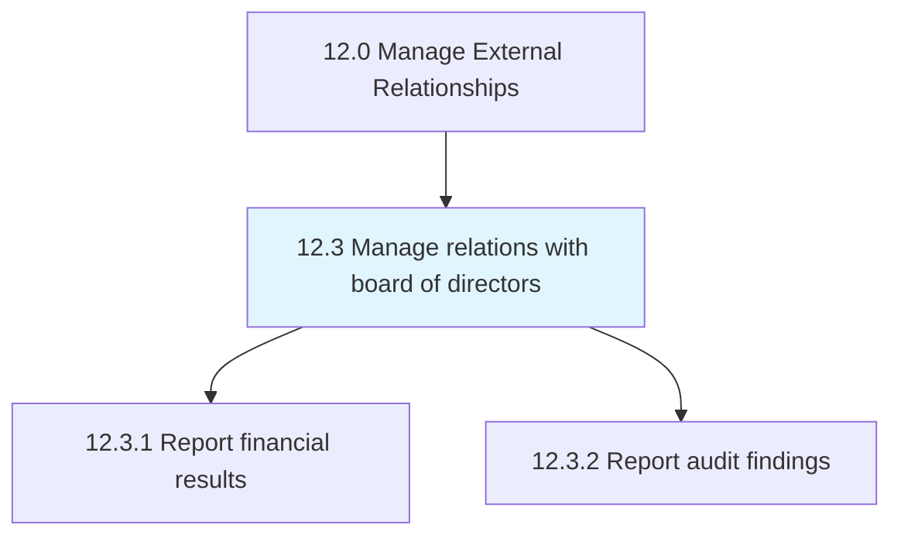
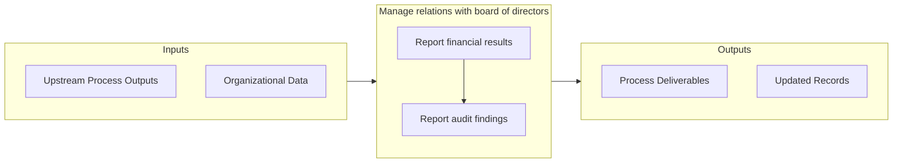

# Manage relations with board of directors

> Maintaining relations with representatives of the stockholders.

## Overview

Group 12.3 is a process group within APQC Category 12.0 (Manage External Relationships). 

Maintaining relations with representatives of the stockholders. Establish corporate management-related policies and to make decisions on major company issues. Implement practices designed to engender communication, trust, and cooperation.

## Process Hierarchy



## Key Statistics

| Metric | Value |
|--------|-------|
| APQC Code | 11012 |
| Hierarchy ID | 12.3 |
| Level | Group |
| Parent | [12](../) |
| Sub-Processes | 2 |


## GraphDL Semantic Structure

```graphdl
manage.Relations.with.BoardOfDirectors
```

| Component | Value | Description |
|-----------|-------|-------------|
| Verb | `manage` | Primary action |
| Object | `relations` | Direct object |
| Preposition | `with` | Relationship |
| PrepObject | `board of directors` | Indirect object |


## Process Flow



## Sub-Processes

| Process | Hierarchy ID | Description |
|---------|-------------|-------------|
| [Report financial results](./ReportFinancialResults) | 12.3.1 | Reporting financial results to management, and releasing results to the public |
| [Report audit findings](./ReportAuditFindings) | 12.3.2 | Reporting audit findings to management |


## Related Concepts

- Relations
- BoardOfDirectors


---

*Source: APQC PCF 11012 (12.3) - APQC*
