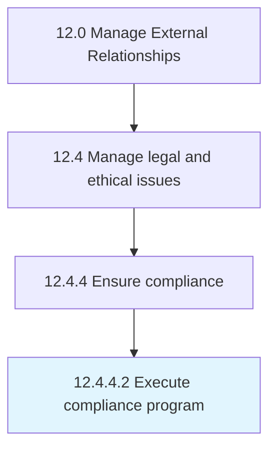

# Execute compliance program

> Implementing the established compliance program in order to meet the government laws and regulations.

## Overview

Activity 12.4.4.2 is an activity within the Manage External Relationships framework. 

Implementing the established compliance program in order to meet the government laws and regulations. Create a compliance team that scrutinizes the rules set out by government bodies such as the Securities and Exchange Commission.

## Process Hierarchy



## Key Statistics

| Metric | Value |
|--------|-------|
| APQC Code | 11054 |
| Hierarchy ID | 12.4.4.2 |
| Level | Activity |
| Parent | [12.4.4](../) |
| Sub-Processes | 0 |


## GraphDL Semantic Structure

```
execute.ComplianceProgram
```

| Component | Value | Description |
|-----------|-------|-------------|
| Verb | `execute` | Primary action |
| Object | `compliance program` | Direct object |


## Related Concepts

- ComplianceProgram


---

*Source: APQC PCF 11054 (12.4.4.2) - APQC*
