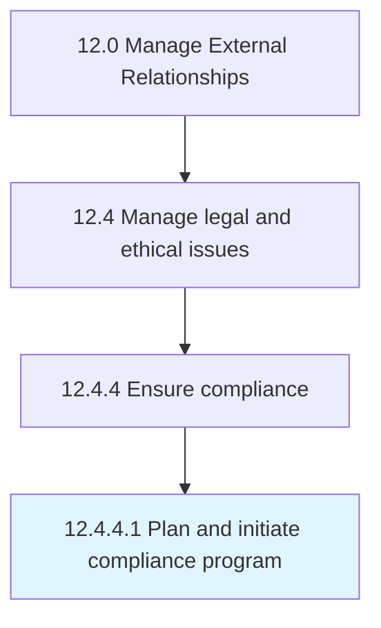

# Plan and initiate compliance program

> Employing an internal system or process to identify and reduce the risk of breaching the Competition and Consumer Act 2010.

## Overview

Activity 12.4.4.1 is an activity within the Manage External Relationships framework. 

Employing an internal system or process to identify and reduce the risk of breaching the Competition and Consumer Act 2010. Remedy any breach. Create a culture of compliance. Design compliance programs.

## Process Hierarchy



## Key Statistics

| Metric | Value |
|--------|-------|
| APQC Code | 11053 |
| Hierarchy ID | 12.4.4.1 |
| Level | Activity |
| Parent | [12.4.4](../) |
| Sub-Processes | 0 |


## GraphDL Semantic Structure

```
plan.AndInitiateComplianceProgram
```

| Component | Value | Description |
|-----------|-------|-------------|
| Verb | `plan` | Primary action |
| Object | `and initiate compliance program` | Direct object |


## Related Concepts

- [ComplianceProgram](/concepts/ComplianceProgram)
- [ComplianceProgram](/concepts/ComplianceProgram)


---

*Source: APQC PCF 11053 (12.4.4.1) - APQC*
