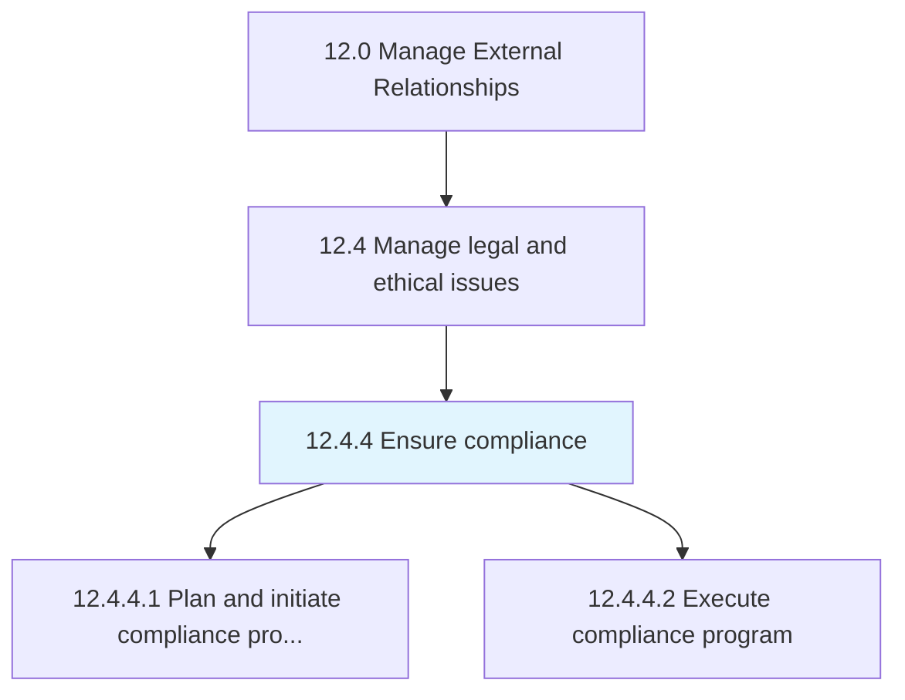
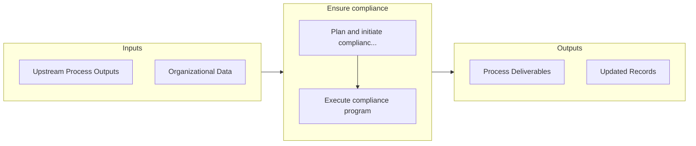

# Ensure compliance

> Ensuring the organization's compliance position.

## Overview

Process 12.4.4 is a core process that defines the specific procedures for ensure compliance. 

Ensuring the organization's compliance position. Validate compliance with different statutes, regulatory directions, and legal principles (using Establish compliance framework and policies [17468]). Coordinate with compliance and risk management personnel.

## Process Hierarchy



## Key Statistics

| Metric | Value |
|--------|-------|
| APQC Code | 11047 |
| Hierarchy ID | 12.4.4 |
| Level | Process |
| Parent | [12.4](../) |
| Sub-Processes | 2 |


## GraphDL Semantic Structure

```graphdl
ensure.Compliance
```

| Component | Value | Description |
|-----------|-------|-------------|
| Verb | `ensure` | Primary action |
| Object | `compliance` | Direct object |


## Process Flow



## Sub-Processes

| Process | Hierarchy ID | Description |
|---------|-------------|-------------|
| [Plan and initiate compliance program](./PlanAndInitiateComplianceProgram) | 12.4.4.1 | Employing an internal system or process to identify and reduce the risk of breaching the Competition |
| [Execute compliance program](./ExecuteComplianceProgram) | 12.4.4.2 | Implementing the established compliance program in order to meet the government laws and regulations |


## Related Concepts

- Compliance


---

*Source: APQC PCF 11047 (12.4.4) - APQC*
