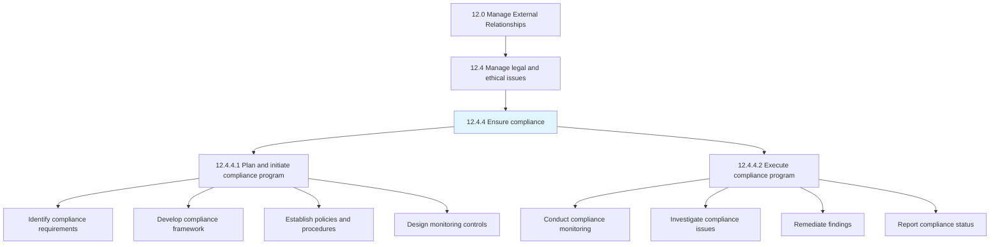
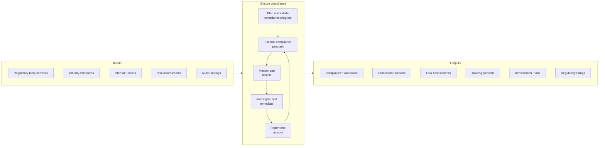
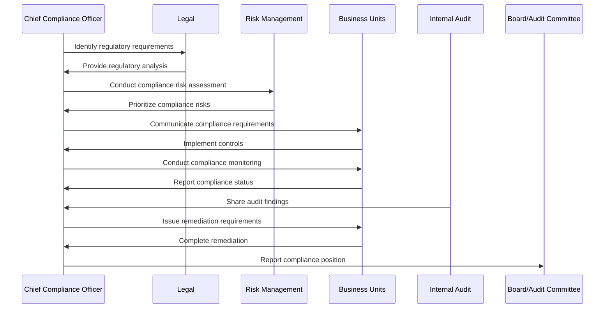
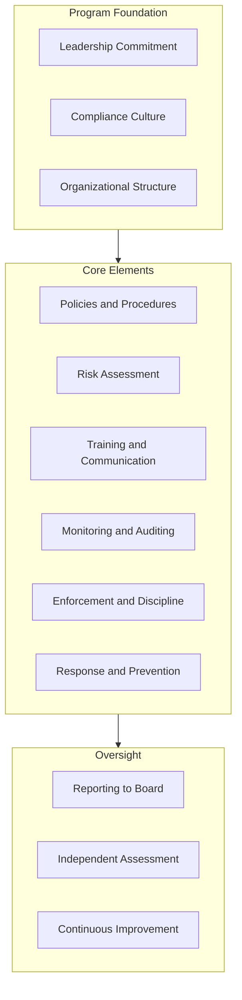
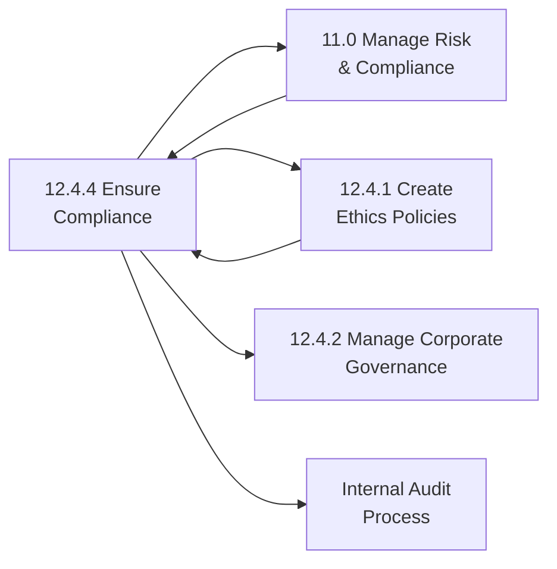

# Ensure compliance

> Ensuring the organization's compliance position.

## Overview

Process 12.4.4 is a core process within Process Group 12.4 (Manage Legal and Ethical Issues) that defines the specific procedures for ensuring organizational compliance.

Ensuring compliance is a critical governance function that validates the organization's adherence to laws, regulations, industry standards, and internal policies. This process encompasses establishing compliance frameworks, monitoring compliance status, identifying and remediating gaps, and maintaining documentation of the organization's compliance position.

Effective compliance management protects the organization from legal and regulatory sanctions, reputational damage, and financial losses. It requires coordination across legal, risk management, internal audit, and business operations to ensure comprehensive coverage of all applicable requirements.

The compliance function has grown significantly in importance and complexity as organizations face an expanding universe of regulatory requirements including data privacy (GDPR, CCPA), anti-corruption (FCPA, UK Bribery Act), financial regulations (SOX, Dodd-Frank), and industry-specific rules. Organizations with mature compliance capabilities demonstrate proactive risk identification, systematic monitoring, and continuous improvement in their control environments.

Key activities include establishing compliance policies and frameworks, conducting compliance assessments, monitoring regulatory changes, managing compliance training, investigating violations, and reporting compliance status to leadership and the board.

## Process Hierarchy



## Key Statistics

| Metric | Value |
|--------|-------|
| APQC Code | 11047 |
| Hierarchy ID | 12.4.4 |
| Level | Process |
| Parent | [12.4 Manage Legal and Ethical Issues](../) |
| Sub-Processes | 2 |
| Industry Applicability | All industries, critical for regulated sectors |


## GraphDL Semantic Structure

```graphdl
ensure.Compliance
```

| Component | Value | Description |
|-----------|-------|-------------|
| Verb | `ensure` | Primary action - verification and assurance |
| Object | `compliance` | Direct object - adherence to requirements |


## Process Flow



## Sub-Processes

| Process | Hierarchy ID | Description |
|---------|-------------|-------------|
| [Plan and initiate compliance program](./PlanAndInitiateComplianceProgram) | 12.4.4.1 | Employing an internal system or process to identify and reduce the risk of breaching regulatory requirements. Includes identifying applicable regulations, conducting compliance risk assessments, developing compliance frameworks, establishing policies and procedures, and designing monitoring and control mechanisms. |
| [Execute compliance program](./ExecuteComplianceProgram) | 12.4.4.2 | Implementing the established compliance program to meet government laws and regulations. Includes conducting compliance monitoring, managing compliance training, investigating potential violations, remediating findings, maintaining compliance documentation, and reporting compliance status to stakeholders. |

## Activity Sequence



## RACI Matrix

| Activity | Chief Compliance Officer | General Counsel | Business Unit Leaders | Internal Audit | Risk Management | Board/Audit Committee |
|----------|-------------------------|-----------------|----------------------|----------------|-----------------|----------------------|
| Identify compliance requirements | R | C | C | I | C | I |
| Develop compliance framework | R | A | C | C | C | I |
| Establish policies and procedures | R | A | C | C | C | I |
| Conduct compliance risk assessment | R | C | C | C | A | I |
| Design monitoring controls | R | C | R | C | C | I |
| Conduct compliance monitoring | R | I | R | C | I | I |
| Manage compliance training | R | C | A | I | I | I |
| Investigate compliance issues | R | A | C | C | C | I |
| Remediate compliance findings | C | C | R | C | I | I |
| Report compliance status | R | C | C | I | C | A |
| Maintain compliance documentation | R | I | R | I | I | I |
| Coordinate with regulators | R | A | C | I | I | I |

**Legend:** R = Responsible, A = Accountable, C = Consulted, I = Informed

## Compliance Program Framework



## Metrics and KPIs

### Effectiveness Metrics

| Metric | Description | Target Range |
|--------|-------------|--------------|
| Compliance incident rate | Number of compliance violations per period | Decreasing trend toward zero |
| Regulatory examination findings | Issues identified by regulators | Zero significant findings |
| Training completion rate | Percentage of employees completing required training | 95%+ completion |
| Policy acknowledgment rate | Percentage of employees acknowledging policies | 100% acknowledgment |
| Control effectiveness | Results of control testing | 90%+ controls operating effectively |

### Efficiency Metrics

| Metric | Description | Target Range |
|--------|-------------|--------------|
| Issue resolution time | Days to remediate compliance findings | Within established timeframes |
| Monitoring cycle time | Time to complete compliance assessments | On schedule |
| Training deployment time | Days to deploy new compliance training | Within 30 days of requirement |
| Regulatory response time | Time to respond to regulatory inquiries | Within regulatory deadlines |

### Outcome Metrics

| Metric | Description | Target Range |
|--------|-------------|--------------|
| Regulatory penalties | Financial penalties from regulatory violations | Zero penalties |
| Reputation incidents | Compliance-related reputation events | Zero incidents |
| Audit findings trend | Year-over-year change in audit findings | Decreasing trend |
| Compliance culture score | Employee survey results on compliance culture | 80%+ positive |
| Third-party compliance | Vendor compliance assessment results | 90%+ compliant vendors |

## Related Departments and Occupations

### Primary Departments

| Department | Role in Process |
|------------|-----------------|
| Compliance | Primary owner of compliance program |
| Legal | Interprets regulations, handles regulatory relationships |
| Internal Audit | Provides independent assessment of compliance |
| Risk Management | Integrates compliance into enterprise risk framework |
| Human Resources | Manages compliance training and enforcement |
| Business Units | Implements compliance controls day-to-day |

### Key Occupations

| Occupation | Responsibilities |
|------------|------------------|
| Chief Compliance Officer | Leads compliance program strategy and operations |
| Compliance Manager | Manages specific compliance domains |
| Compliance Analyst | Conducts monitoring and assessments |
| General Counsel | Provides legal interpretation and regulatory advice |
| Internal Auditor | Independently tests compliance controls |
| Risk Manager | Integrates compliance risks into risk framework |
| Ethics Officer | Manages ethics program and investigations |

## Compliance Domains

| Domain | Key Regulations | Typical Controls |
|--------|-----------------|------------------|
| Data Privacy | GDPR, CCPA, HIPAA | Data mapping, consent management, breach response |
| Anti-Corruption | FCPA, UK Bribery Act | Third-party due diligence, gift policies, training |
| Financial Reporting | SOX, SEC Rules | Internal controls, disclosure procedures |
| Employment | FLSA, EEOC, OSHA | HR policies, workplace safety, anti-discrimination |
| Environmental | EPA, Clean Air Act | Environmental management, reporting |
| Industry-Specific | Various | Depends on sector (banking, healthcare, etc.) |

## Industry Variations

### Financial Services

Banks and financial institutions face extensive compliance requirements from multiple regulators (Federal Reserve, OCC, CFPB, SEC, FINRA). Compliance programs must address capital requirements, consumer protection, anti-money laundering, and market conduct.

**Industry-Specific Activities:**
- BSA/AML compliance monitoring
- Consumer protection compliance
- Trading compliance surveillance
- Capital and liquidity compliance

### Healthcare

Healthcare organizations navigate HIPAA, FDA, CMS, and state health regulations. Compliance programs focus on patient privacy, billing compliance, clinical quality, and research ethics.

**Industry-Specific Activities:**
- HIPAA privacy and security
- Medicare/Medicaid billing compliance
- Clinical trial compliance
- Stark Law and Anti-Kickback compliance

### Life Sciences

Pharmaceutical and medical device companies face FDA regulations, clinical trial requirements, and global regulatory compliance. Compliance programs address product safety, marketing practices, and supply chain integrity.

**Industry-Specific Activities:**
- FDA regulatory compliance
- Good Manufacturing Practices (GMP)
- Clinical trial protocols
- Off-label marketing prevention

### Technology

Technology companies address data privacy, platform responsibility, export controls, and emerging AI governance requirements. Compliance programs must adapt rapidly to evolving regulations.

**Industry-Specific Activities:**
- Global data privacy compliance
- Content moderation compliance
- Export control compliance
- AI governance compliance

## Related Processes



## Related Concepts

- Compliance
- RegulatoryCompliance
- ComplianceProgram
- RiskManagement
- InternalControls
- Ethics
- CorporateGovernance


---

*Source: APQC PCF 11047 (12.4.4) - APQC*
