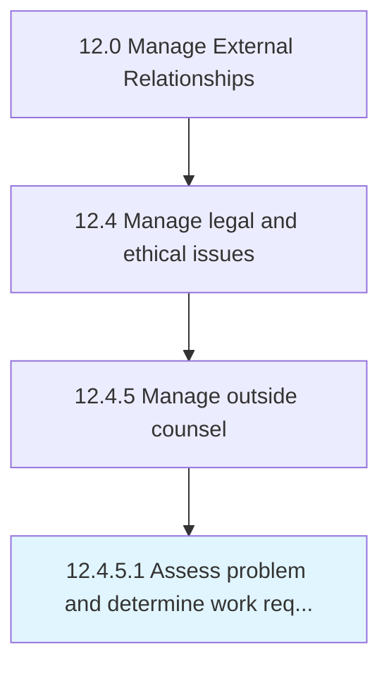

# Assess problem and determine work requirements

> Examining the problems and deciding the action requirements for engaging outside counsel.

## Overview

Activity 12.4.5.1 is an activity within the Manage External Relationships framework. 

Examining the problems and deciding the action requirements for engaging outside counsel. This process element calls upon the organization to internally analyze the issues for which assistance from external counsel is needed. Additionally, the organization needs to break-down the issue, identifying the tasks and exercises where outside counsel can help.

## Process Hierarchy



## Key Statistics

| Metric | Value |
|--------|-------|
| APQC Code | 11056 |
| Hierarchy ID | 12.4.5.1 |
| Level | Activity |
| Parent | [12.4.5](../) |
| Sub-Processes | 0 |


## GraphDL Semantic Structure

```
assess.ProblemAndDetermineWorkRequirements
```

| Component | Value | Description |
|-----------|-------|-------------|
| Verb | `assess` | Primary action |
| Object | `problem and determine work requirements` | Direct object |


## Related Concepts

- Problem
- DetermineWorkRequirements


---

*Source: APQC PCF 11056 (12.4.5.1) - APQC*
