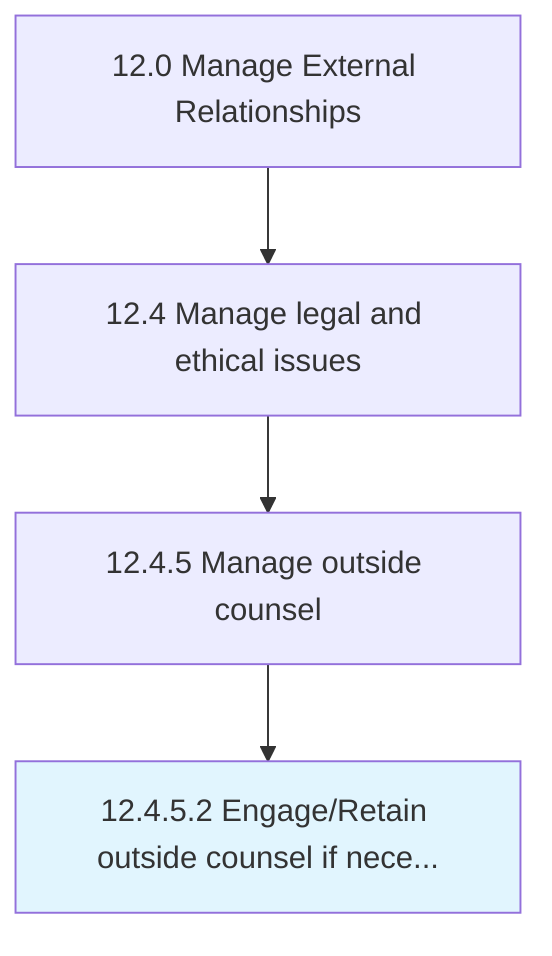

# Engage/Retain outside counsel if necessary

> Recruiting the assistance of outside counsel for any legal and/or ethical concerns.

## Overview

Activity 12.4.5.2 is an activity within the Manage External Relationships framework. 

Recruiting the assistance of outside counsel for any legal and/or ethical concerns. Engage and/or retain any external counsel sought from subject matter experts and professionals.

## Process Hierarchy



## Key Statistics

| Metric | Value |
|--------|-------|
| APQC Code | 11057 |
| Hierarchy ID | 12.4.5.2 |
| Level | Activity |
| Parent | [12.4.5](../) |
| Sub-Processes | 0 |


## GraphDL Semantic Structure

```
engage/retain.OutsideCounselIfNecessary
```

| Component | Value | Description |
|-----------|-------|-------------|
| Verb | `engage/retain` | Primary action |
| Object | `outside counsel if necessary` | Direct object |


## Related Concepts

- [CounselIfNecessary](/concepts/CounselIfNecessary)
- [CounselIfNecessary](/concepts/CounselIfNecessary)


---

*Source: APQC PCF 11057 (12.4.5.2) - APQC*
