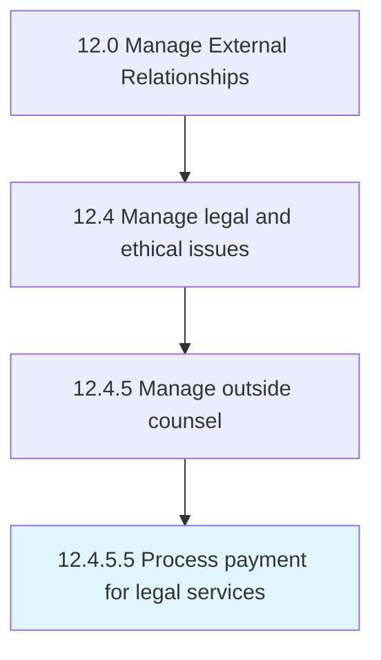

# Process payment for legal services

> Making payments to legal advisers for their services.

## Overview

Activity 12.4.5.5 is an activity within the Manage External Relationships framework. 

Making payments to legal advisers for their services. Payments include addressing issues or suits by customers, suppliers, competitors, bankers, government agencies, etc.

## Process Hierarchy



## Key Statistics

| Metric | Value |
|--------|-------|
| APQC Code | 11060 |
| Hierarchy ID | 12.4.5.5 |
| Level | Activity |
| Parent | [12.4.5](../) |
| Sub-Processes | 0 |


## GraphDL Semantic Structure

```
process.Payment.for.LegalServices
```

| Component | Value | Description |
|-----------|-------|-------------|
| Verb | `process` | Primary action |
| Object | `payment` | Direct object |
| Preposition | `for` | Relationship |
| PrepObject | `legal services` | Indirect object |


## Related Concepts

- Payment
- LegalServices


---

*Source: APQC PCF 11060 (12.4.5.5) - APQC*
