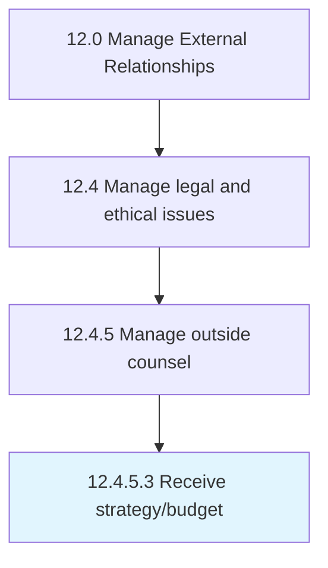

# Receive strategy/budget

> Making a financial plan.

## Overview

Activity 12.4.5.3 is an activity within the Manage External Relationships framework. 

Making a financial plan. This strategy sets out, using figures, an organization's expected future results. Enlist the finance function to support work generated by other business functions in order to build and secure their support for the budget.

## Process Hierarchy



## Key Statistics

| Metric | Value |
|--------|-------|
| APQC Code | 11058 |
| Hierarchy ID | 12.4.5.3 |
| Level | Activity |
| Parent | [12.4.5](../) |
| Sub-Processes | 0 |


## GraphDL Semantic Structure

```
receive.Strategybudget
```

| Component | Value | Description |
|-----------|-------|-------------|
| Verb | `receive` | Primary action |
| Object | `strategy/budget` | Direct object |


## Related Concepts

- Strategy
- Budget


---

*Source: APQC PCF 11058 (12.4.5.3) - APQC*
