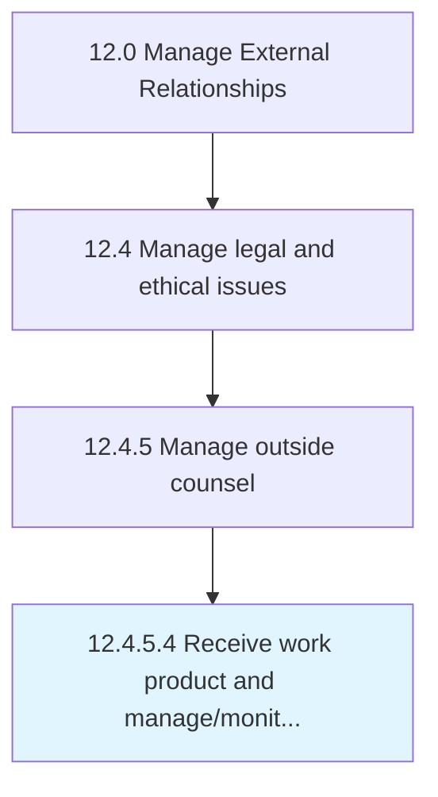

# Receive work product and manage/monitor case and work performed

> Receiving deliverables from outside counsel, and monitoring the efforts committed by them.

## Overview

Activity 12.4.5.4 is an activity within the Manage External Relationships framework. 

Receiving deliverables from outside counsel, and monitoring the efforts committed by them. Track the progress of, collect, and validate the required work product from the subject matter experts and professionals engaged as external counsel. Verify the amount of effort dedicated by these counsels to the issue at hand, in order to confirm their fees.

## Process Hierarchy



## Key Statistics

| Metric | Value |
|--------|-------|
| APQC Code | 11059 |
| Hierarchy ID | 12.4.5.4 |
| Level | Activity |
| Parent | [12.4.5](../) |
| Sub-Processes | 0 |


## GraphDL Semantic Structure

```
receive.WorkProductAndManagemonitorCaseAndWorkPerformed
```

| Component | Value | Description |
|-----------|-------|-------------|
| Verb | `receive` | Primary action |
| Object | `work product and manage/monitor case and work performed` | Direct object |


## Related Concepts

- [WorkProductCase](/concepts/WorkProductCase)
- [WorkPerformed](/concepts/WorkPerformed)
- [ManageCase](/concepts/ManageCase)
- [WorkPerformed](/concepts/WorkPerformed)
- [MonitorCase](/concepts/MonitorCase)
- [WorkPerformed](/concepts/WorkPerformed)


---

*Source: APQC PCF 11059 (12.4.5.4) - APQC*
