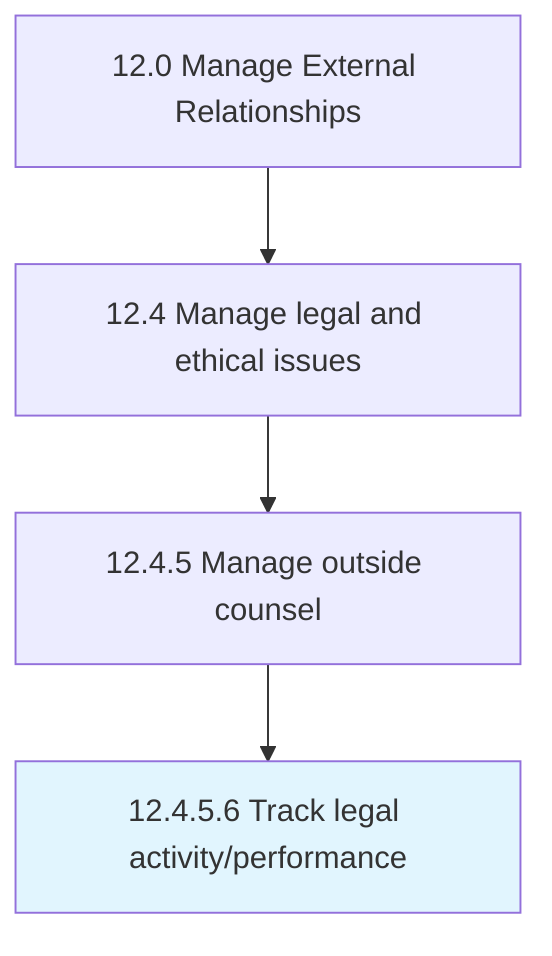

# Track legal activity/performance

> Keeping track of the legal activities and performance of the organization.

## Overview

Activity 12.4.5.6 is an activity within the Manage External Relationships framework. 

Keeping track of the legal activities and performance of the organization.

## Process Hierarchy



## Key Statistics

| Metric | Value |
|--------|-------|
| APQC Code | 11061 |
| Hierarchy ID | 12.4.5.6 |
| Level | Activity |
| Parent | [12.4.5](../) |
| Sub-Processes | 0 |


## GraphDL Semantic Structure

```
track.LegalActivityperformance
```

| Component | Value | Description |
|-----------|-------|-------------|
| Verb | `track` | Primary action |
| Object | `legal activity/performance` | Direct object |


## Related Concepts

- [LegalActivity](/concepts/LegalActivity)
- [LegalPerformance](/concepts/LegalPerformance)


---

*Source: APQC PCF 11061 (12.4.5.6) - APQC*
