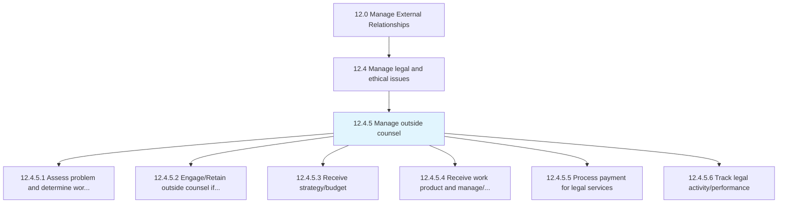
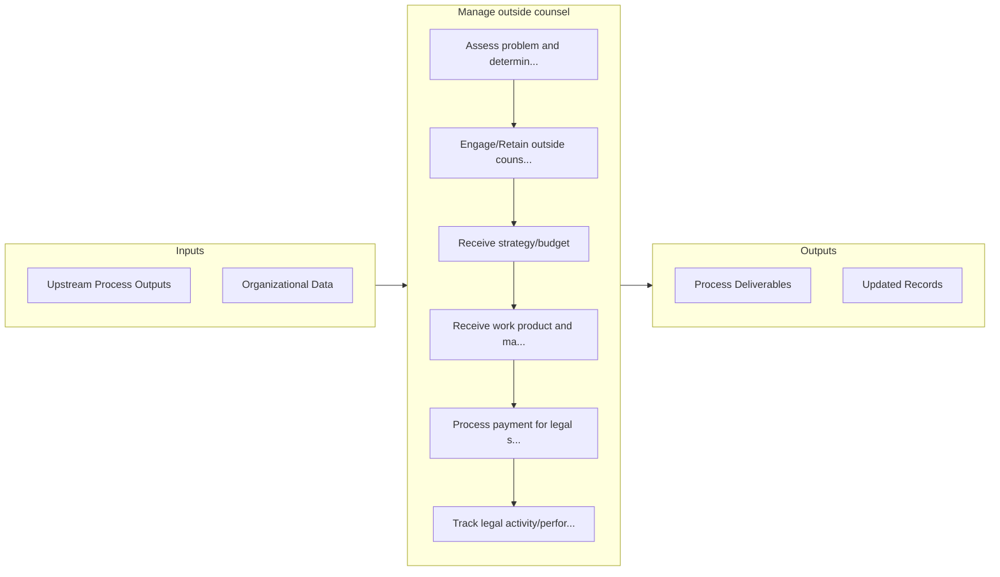

# Manage outside counsel

> Managing professionals, sought externally for assistance over legal and ethical concerns.

## Overview

Process 12.4.5 is a core process that defines the specific procedures for manage outside counsel. 

Managing professionals, sought externally for assistance over legal and ethical concerns. Administer and oversee assistance from subject matter experts and professionals for sourcing expert opinion and counseling over legal and ethical matters.

## Process Hierarchy



## Key Statistics

| Metric | Value |
|--------|-------|
| APQC Code | 11048 |
| Hierarchy ID | 12.4.5 |
| Level | Process |
| Parent | [12.4](../) |
| Sub-Processes | 6 |


## GraphDL Semantic Structure

```
manage.OutsideCounsel
```

| Component | Value | Description |
|-----------|-------|-------------|
| Verb | `manage` | Primary action |
| Object | `outside counsel` | Direct object |


## Process Flow



## Sub-Processes

| Process | Hierarchy ID | Description |
|---------|-------------|-------------|
| [Assess problem and determine work requirements](./AssessProblemAndDetermineWorkRequirements) | 12.4.5.1 | Examining the problems and deciding the action requirements for engaging outside counsel |
| [Engage/Retain outside counsel if necessary](./EngageRetainOutsideCounselIfNecessary) | 12.4.5.2 | Recruiting the assistance of outside counsel for any legal and/or ethical concerns |
| [Receive strategy/budget](./ReceiveStrategybudget) | 12.4.5.3 | Making a financial plan |
| [Receive work product and manage/monitor case and work performed](./ReceiveWorkProductAndManagemonitorCaseAndWorkPerformed) | 12.4.5.4 | Receiving deliverables from outside counsel, and monitoring the efforts committed by them |
| [Process payment for legal services](./ProcessPaymentForLegalServices) | 12.4.5.5 | Making payments to legal advisers for their services |
| [Track legal activity/performance](./TrackLegalActivityperformance) | 12.4.5.6 | Keeping track of the legal activities and performance of the organization |


## Related Concepts

- [Counsel](/concepts/Counsel)


---

*Source: APQC PCF 11048 (12.4.5) - APQC*
