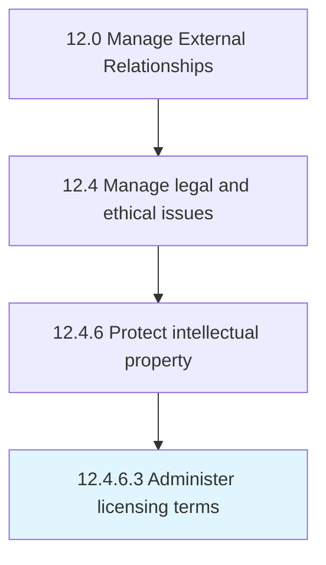

# Administer licensing terms

> Administering and overseeing the terms and policies associated with licensing the organization's intellectual property.

## Overview

Activity 12.4.6.3 is an activity within the Manage External Relationships framework. 

Administering and overseeing the terms and policies associated with licensing the organization's intellectual property. Create and manage the policies and terms governing the possible granting of a license to any external agent. Demarcate a clear framework that governs the licensing of any patents or copyrights held by the organization.

## Process Hierarchy



## Key Statistics

| Metric | Value |
|--------|-------|
| APQC Code | 11064 |
| Hierarchy ID | 12.4.6.3 |
| Level | Activity |
| Parent | [12.4.6](../) |
| Sub-Processes | 0 |


## GraphDL Semantic Structure

```
administer.LicensingTerms
```

| Component | Value | Description |
|-----------|-------|-------------|
| Verb | `administer` | Primary action |
| Object | `licensing terms` | Direct object |


## Related Concepts

- [LicensingTerms](/concepts/LicensingTerms)


---

*Source: APQC PCF 11064 (12.4.6.3) - APQC*
