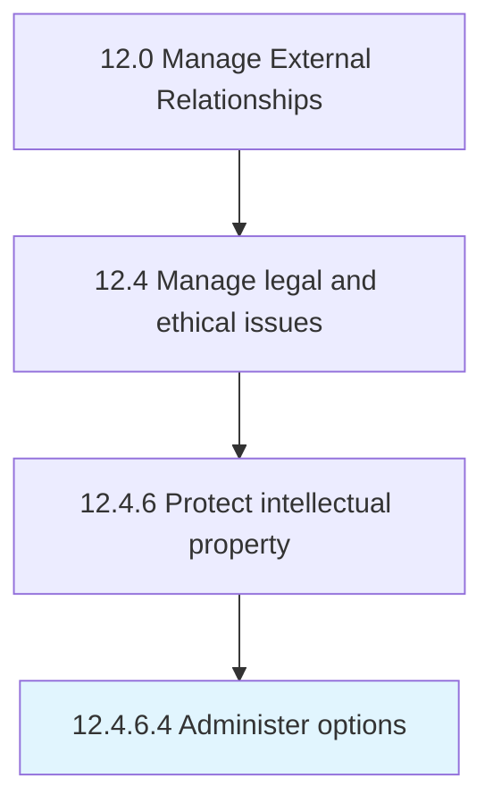

# Administer options

> Managing options regarding licensing agreements.

## Overview

Activity 12.4.6.4 is an activity within the Manage External Relationships framework. 

Managing options regarding licensing agreements. Follow favorable terms and conditions.

## Process Hierarchy



## Key Statistics

| Metric | Value |
|--------|-------|
| APQC Code | 11065 |
| Hierarchy ID | 12.4.6.4 |
| Level | Activity |
| Parent | [12.4.6](../) |
| Sub-Processes | 0 |


## GraphDL Semantic Structure

```
administer.Options
```

| Component | Value | Description |
|-----------|-------|-------------|
| Verb | `administer` | Primary action |
| Object | `options` | Direct object |


## Related Concepts

- [Options](/concepts/Options)


---

*Source: APQC PCF 11065 (12.4.6.4) - APQC*
