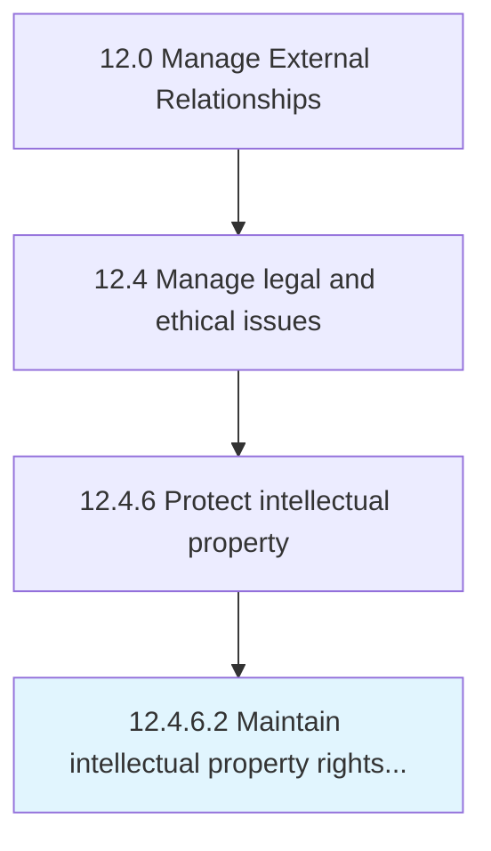

# Maintain intellectual property rights and restrictions

> Managing the upkeep of intellectual property rights by creating and managing a framework of rules, policies, procedures, and restrictions.

## Overview

Activity 12.4.6.2 is an activity within the Manage External Relationships framework. 

Managing the upkeep of intellectual property rights by creating and managing a framework of rules, policies, procedures, and restrictions. Outline a clear policy for any possible scenario of their use by any external agent.

## Process Hierarchy



## Key Statistics

| Metric | Value |
|--------|-------|
| APQC Code | 11063 |
| Hierarchy ID | 12.4.6.2 |
| Level | Activity |
| Parent | [12.4.6](../) |
| Sub-Processes | 0 |


## GraphDL Semantic Structure

```
maintain.IntellectualPropertyRightsAndRestrictions
```

| Component | Value | Description |
|-----------|-------|-------------|
| Verb | `maintain` | Primary action |
| Object | `intellectual property rights and restrictions` | Direct object |


## Related Concepts

- [IntellectualPropertyRights](/concepts/IntellectualPropertyRights)
- [Restrictions](/concepts/Restrictions)


---

*Source: APQC PCF 11063 (12.4.6.2) - APQC*
