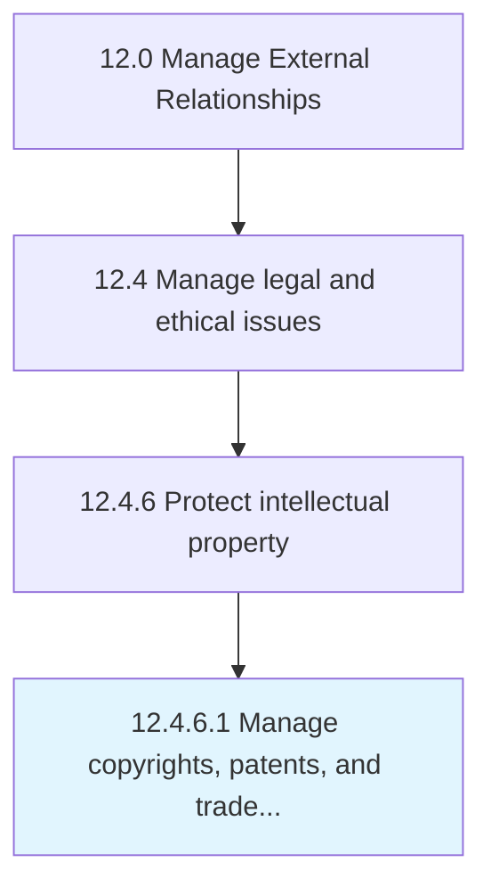

# Manage copyrights, patents, and trademarks

> Managing the patents and copyrights already held or sought by the organization.

## Overview

Activity 12.4.6.1 is an activity within the Manage External Relationships framework. 

Managing the patents and copyrights already held or sought by the organization. Administer and oversee applying for, securing, and maintaining intellectual property rights in the form of patents and copyrights. Submit applications for such rights. Handle associated legal issues. Draft and communicate proper attributions. Collect royalties. Monitor any misuse of the intellectual property rights.

## Process Hierarchy



## Key Statistics

| Metric | Value |
|--------|-------|
| APQC Code | 11062 |
| Hierarchy ID | 12.4.6.1 |
| Level | Activity |
| Parent | [12.4.6](../) |
| Sub-Processes | 0 |


## GraphDL Semantic Structure

```
manage.CopyrightsPatentsAndTrademarks
```

| Component | Value | Description |
|-----------|-------|-------------|
| Verb | `manage` | Primary action |
| Object | `copyrights, patents, and trademarks` | Direct object |


## Related Concepts

- Copyrights
- Patents
- Trademarks


---

*Source: APQC PCF 11062 (12.4.6.1) - APQC*
