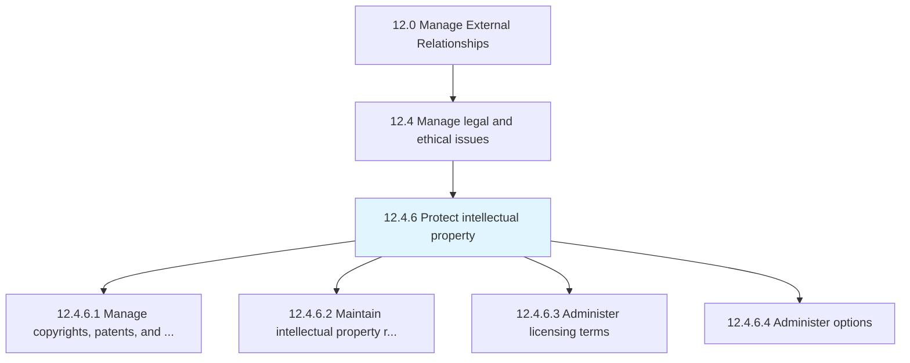
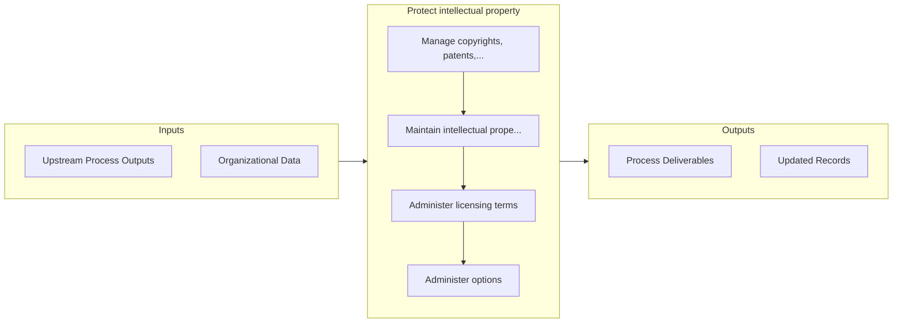

# Protect intellectual property

> Safeguarding the intellectual property of the organization.

## Overview

Process 12.4.6 is a core process that defines the specific procedures for protect intellectual property. 

Safeguarding the intellectual property of the organization. This process requires the organization to protect a wide variety of intellectual property created by it. It involves creating and managing non-disclosure agreements (NDAs), following up on current developments in the areas where the organization holds patents, tracking the use of the organization's copyrighted material, creating and upholding licensing terms, and administering policies for safeguarding intellectual property.

## Process Hierarchy



## Key Statistics

| Metric | Value |
|--------|-------|
| APQC Code | 11049 |
| Hierarchy ID | 12.4.6 |
| Level | Process |
| Parent | [12.4](../) |
| Sub-Processes | 4 |


## GraphDL Semantic Structure

```graphdl
protect.IntellectualProperty
```

| Component | Value | Description |
|-----------|-------|-------------|
| Verb | `protect` | Primary action |
| Object | `intellectual property` | Direct object |


## Process Flow



## Sub-Processes

| Process | Hierarchy ID | Description |
|---------|-------------|-------------|
| [Manage copyrights, patents, and trademarks](./ManageCopyrightsPatentsAndTrademarks) | 12.4.6.1 | Managing the patents and copyrights already held or sought by the organization |
| [Maintain intellectual property rights and restrictions](./MaintainIntellectualPropertyRightsAndRestrictions) | 12.4.6.2 | Managing the upkeep of intellectual property rights by creating and managing a framework of rules, p |
| [Administer licensing terms](./AdministerLicensingTerms) | 12.4.6.3 | Administering and overseeing the terms and policies associated with licensing the organization's int |
| [Administer options](./AdministerOptions) | 12.4.6.4 | Managing options regarding licensing agreements |


## Related Concepts

- IntellectualProperty


---

*Source: APQC PCF 11049 (12.4.6) - APQC*
