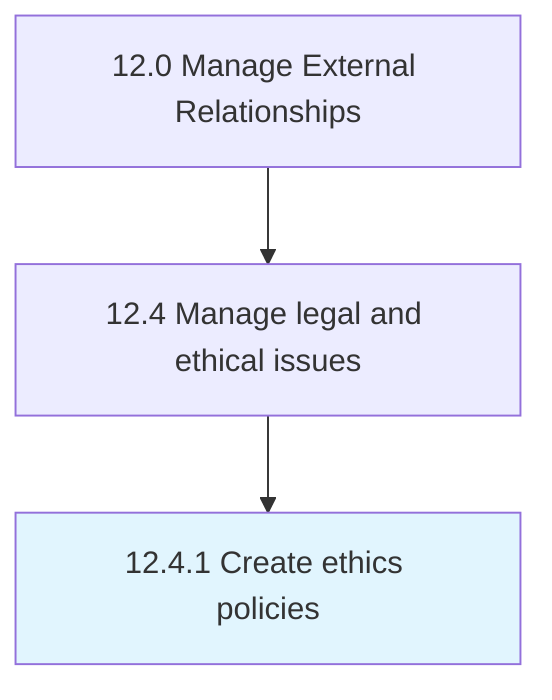

# Create ethics policies

> Creating a code of ethics that communicate the organization's philosophy to employees, vendors, customers, clients, and the public.

## Overview

Process 12.4.1 is a core process that defines the specific procedures for create ethics policies. 

Creating a code of ethics that communicate the organization's philosophy to employees, vendors, customers, clients, and the public.

## Process Hierarchy



## Key Statistics

| Metric | Value |
|--------|-------|
| APQC Code | 11044 |
| Hierarchy ID | 12.4.1 |
| Level | Process |
| Parent | [12.4](../) |
| Sub-Processes | 0 |


## GraphDL Semantic Structure

```
create.EthicsPolicies
```

| Component | Value | Description |
|-----------|-------|-------------|
| Verb | `create` | Primary action |
| Object | `ethics policies` | Direct object |


## Related Concepts

- EthicsPolicies


---

*Source: APQC PCF 11044 (12.4.1) - APQC*
