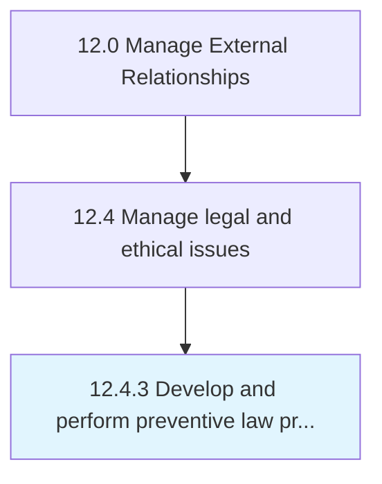

# Develop and perform preventive law programs

> Creating and applying programs and activities.

## Overview

Process 12.4.3 is a core process that defines the specific procedures for develop and perform preventive law programs. 

Creating and applying programs and activities. Encourage the adherence preventive laws, such as environmental law, sex discrimination, computer law, estate planning, corporate compliance, business planning, and property transactions.

## Process Hierarchy



## Key Statistics

| Metric | Value |
|--------|-------|
| APQC Code | 11046 |
| Hierarchy ID | 12.4.3 |
| Level | Process |
| Parent | [12.4](../) |
| Sub-Processes | 0 |


## GraphDL Semantic Structure

```
develop.AndPerformPreventiveLawPrograms
```

| Component | Value | Description |
|-----------|-------|-------------|
| Verb | `develop` | Primary action |
| Object | `and perform preventive law programs` | Direct object |


## Related Concepts

- PreventiveLawPrograms
- PreventiveLawPrograms


---

*Source: APQC PCF 11046 (12.4.3) - APQC*
