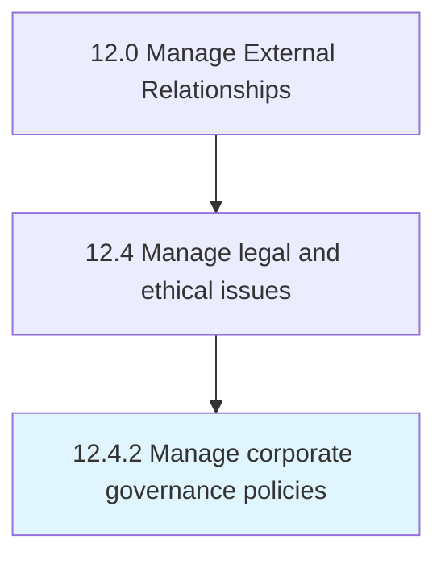

# Manage corporate governance policies

> Administering the system of rules, practices, and processes through which a company is directed and controlled.

## Overview

Process 12.4.2 is a core process that defines the specific procedures for manage corporate governance policies. 

Administering the system of rules, practices, and processes through which a company is directed and controlled. Balance stakeholder interests including shareholders, management, customers, suppliers, financiers, government, and the community. Outline a strategy for achieving organizational goals, from action plans and internal controls to performance measurement and corporate disclosure.

## Process Hierarchy



## Key Statistics

| Metric | Value |
|--------|-------|
| APQC Code | 11045 |
| Hierarchy ID | 12.4.2 |
| Level | Process |
| Parent | [12.4](../) |
| Sub-Processes | 0 |


## GraphDL Semantic Structure

```
manage.CorporateGovernancePolicies
```

| Component | Value | Description |
|-----------|-------|-------------|
| Verb | `manage` | Primary action |
| Object | `corporate governance policies` | Direct object |


## Related Concepts

- [CorporateGovernancePolicies](/concepts/CorporateGovernancePolicies)


---

*Source: APQC PCF 11045 (12.4.2) - APQC*
