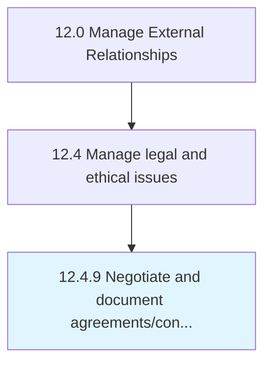

# Negotiate and document agreements/contracts

> Negotiating terms to reach a final draft of a contract that is acceptable to all parties.

## Overview

Process 12.4.9 is a core process that defines the specific procedures for negotiate and document agreements/contracts. 

Negotiating terms to reach a final draft of a contract that is acceptable to all parties.

## Process Hierarchy



## Key Statistics

| Metric | Value |
|--------|-------|
| APQC Code | 11052 |
| Hierarchy ID | 12.4.9 |
| Level | Process |
| Parent | [12.4](../) |
| Sub-Processes | 0 |


## GraphDL Semantic Structure

```
negotiate.AndDocumentAgreementscontracts
```

| Component | Value | Description |
|-----------|-------|-------------|
| Verb | `negotiate` | Primary action |
| Object | `and document agreements/contracts` | Direct object |


## Related Concepts

- Agreements
- Contracts
- Agreements
- Contracts


---

*Source: APQC PCF 11052 (12.4.9) - APQC*
