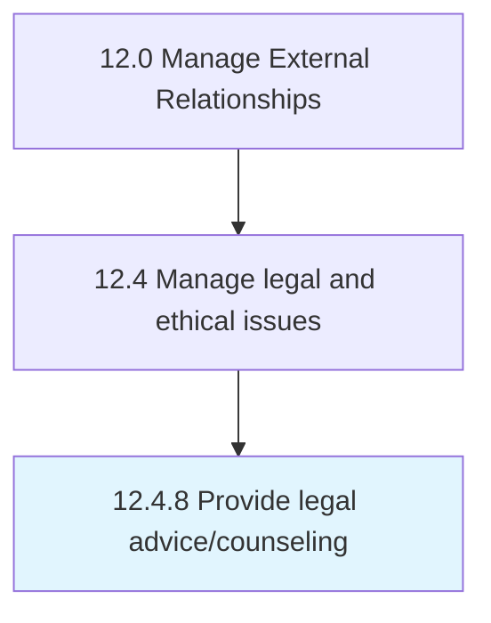

# Provide legal advice/counseling

> Providing legal advice concerning the substance or procedure of a law in relation to a particular situation.

## Overview

Process 12.4.8 is a core process that defines the specific procedures for provide legal advice/counseling. 

Providing legal advice concerning the substance or procedure of a law in relation to a particular situation.

## Process Hierarchy



## Key Statistics

| Metric | Value |
|--------|-------|
| APQC Code | 11051 |
| Hierarchy ID | 12.4.8 |
| Level | Process |
| Parent | [12.4](../) |
| Sub-Processes | 0 |


## GraphDL Semantic Structure

```
provide.LegalAdvicecounseling
```

| Component | Value | Description |
|-----------|-------|-------------|
| Verb | `provide` | Primary action |
| Object | `legal advice/counseling` | Direct object |


## Related Concepts

- LegalAdvice
- LegalCounseling


---

*Source: APQC PCF 11051 (12.4.8) - APQC*
