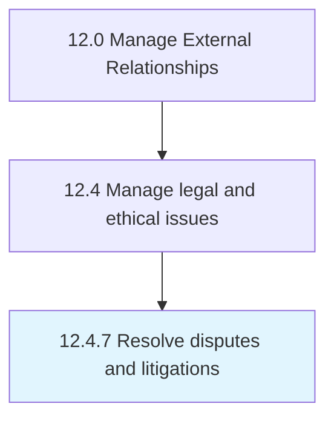

# Resolve disputes and litigations

> Resolving disputes or civil lawsuits internally or externally.

## Overview

Process 12.4.7 is a core process that defines the specific procedures for resolve disputes and litigations. 

Resolving disputes or civil lawsuits internally or externally.

## Process Hierarchy



## Key Statistics

| Metric | Value |
|--------|-------|
| APQC Code | 11050 |
| Hierarchy ID | 12.4.7 |
| Level | Process |
| Parent | [12.4](../) |
| Sub-Processes | 0 |


## GraphDL Semantic Structure

```
resolve.DisputesAndLitigations
```

| Component | Value | Description |
|-----------|-------|-------------|
| Verb | `resolve` | Primary action |
| Object | `disputes and litigations` | Direct object |


## Related Concepts

- Disputes
- Litigations


---

*Source: APQC PCF 11050 (12.4.7) - APQC*
