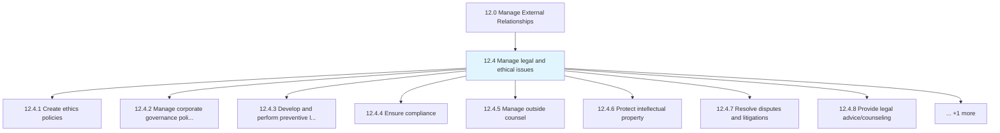
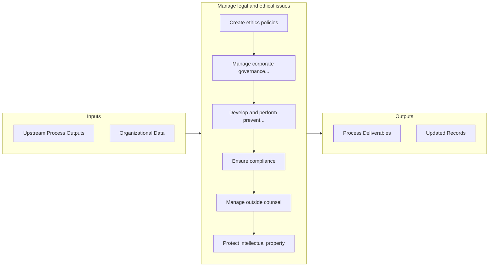

# Manage legal and ethical issues

> Managing legal practices to abide by the law, as well as ethical practices.

## Overview

Group 12.4 is a process group within APQC Category 12.0 (Manage External Relationships). 

Managing legal practices to abide by the law, as well as ethical practices.

## Process Hierarchy



## Key Statistics

| Metric | Value |
|--------|-------|
| APQC Code | 11013 |
| Hierarchy ID | 12.4 |
| Level | Group |
| Parent | [12](../) |
| Sub-Processes | 9 |


## GraphDL Semantic Structure

```
manage.LegalAndEthicalIssues
```

| Component | Value | Description |
|-----------|-------|-------------|
| Verb | `manage` | Primary action |
| Object | `legal and ethical issues` | Direct object |


## Process Flow



## Sub-Processes

| Process | Hierarchy ID | Description |
|---------|-------------|-------------|
| [Create ethics policies](./CreateEthicsPolicies) | 12.4.1 | Creating a code of ethics that communicate the organization's philosophy to employees, vendors, cust |
| [Manage corporate governance policies](./ManageCorporateGovernancePolicies) | 12.4.2 | Administering the system of rules, practices, and processes through which a company is directed and  |
| [Develop and perform preventive law programs](./DevelopAndPerformPreventiveLawPrograms) | 12.4.3 | Creating and applying programs and activities |
| [Ensure compliance](./12.4.4-EnsureCompliance/) | 12.4.4 | Ensuring the organization's compliance position |
| [Manage outside counsel](./12.4.5-ManageOutsideCounsel/) | 12.4.5 | Managing professionals, sought externally for assistance over legal and ethical concerns |
| [Protect intellectual property](./12.4.6-ProtectIntellectualProperty/) | 12.4.6 | Safeguarding the intellectual property of the organization |
| [Resolve disputes and litigations](./ResolveDisputesAndLitigations) | 12.4.7 | Resolving disputes or civil lawsuits internally or externally |
| [Provide legal advice/counseling](./ProvideLegalAdvicecounseling) | 12.4.8 | Providing legal advice concerning the substance or procedure of a law in relation to a particular si |
| [Negotiate and document agreements/contracts](./NegotiateAndDocumentAgreementscontracts) | 12.4.9 | Negotiating terms to reach a final draft of a contract that is acceptable to all parties |


## Related Concepts

- LegalIssues
- EthicalIssues


---

*Source: APQC PCF 11013 (12.4) - APQC*
