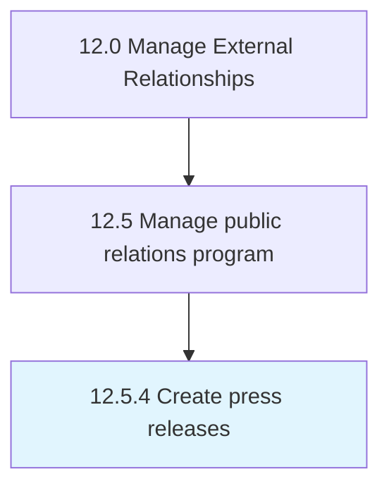

# Create press releases

> Developing press releases to communicate developments and generate interest in the organization.

## Overview

Process 12.5.4 is a core process that defines the specific procedures for create press releases. 

Developing press releases to communicate developments and generate interest in the organization.

## Process Hierarchy



## Key Statistics

| Metric | Value |
|--------|-------|
| APQC Code | 11069 |
| Hierarchy ID | 12.5.4 |
| Level | Process |
| Parent | [12.5](../) |
| Sub-Processes | 0 |


## GraphDL Semantic Structure

```
create.PressReleases
```

| Component | Value | Description |
|-----------|-------|-------------|
| Verb | `create` | Primary action |
| Object | `press releases` | Direct object |


## Related Concepts

- [PressReleases](/concepts/PressReleases)


---

*Source: APQC PCF 11069 (12.5.4) - APQC*
