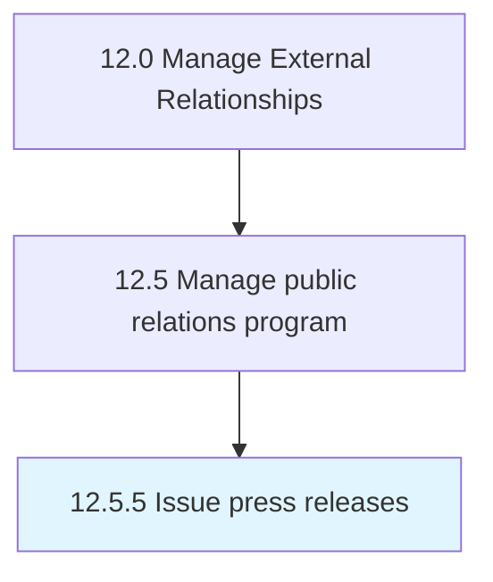

# Issue press releases

> Issuing press releases to carefully selected media in distribution channels such as the web, newspapers, and social media.

## Overview

Process 12.5.5 is a core process that defines the specific procedures for issue press releases. 

Issuing press releases to carefully selected media in distribution channels such as the web, newspapers, and social media.

## Process Hierarchy



## Key Statistics

| Metric | Value |
|--------|-------|
| APQC Code | 11070 |
| Hierarchy ID | 12.5.5 |
| Level | Process |
| Parent | [12.5](../) |
| Sub-Processes | 0 |


## GraphDL Semantic Structure

```
issue.PressReleases
```

| Component | Value | Description |
|-----------|-------|-------------|
| Verb | `issue` | Primary action |
| Object | `press releases` | Direct object |


## Related Concepts

- [PressReleases](/concepts/PressReleases)


---

*Source: APQC PCF 11070 (12.5.5) - APQC*
