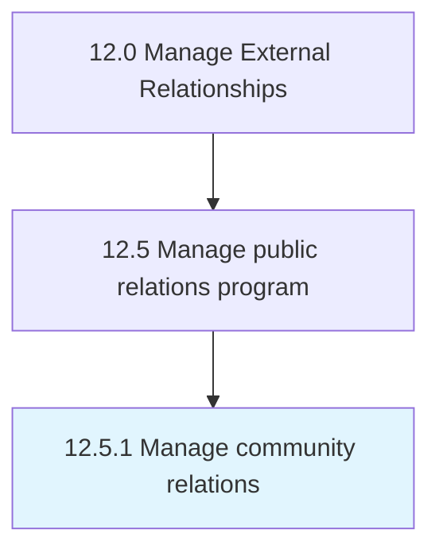

# Manage community relations

> Developing and administering community relations.

## Overview

Process 12.5.1 is a core process that defines the specific procedures for manage community relations. 

Developing and administering community relations. Establish business connections with the people constituting the environment the organization operates in and draws resources from in order to foster mutual understanding, trust, and support. Create programs that promote the organization's image in a positive and community-oriented way.

## Process Hierarchy



## Key Statistics

| Metric | Value |
|--------|-------|
| APQC Code | 11066 |
| Hierarchy ID | 12.5.1 |
| Level | Process |
| Parent | [12.5](../) |
| Sub-Processes | 0 |


## GraphDL Semantic Structure

```
manage.CommunityRelations
```

| Component | Value | Description |
|-----------|-------|-------------|
| Verb | `manage` | Primary action |
| Object | `community relations` | Direct object |


## Related Concepts

- [CommunityRelations](/concepts/CommunityRelations)


---

*Source: APQC PCF 11066 (12.5.1) - APQC*
