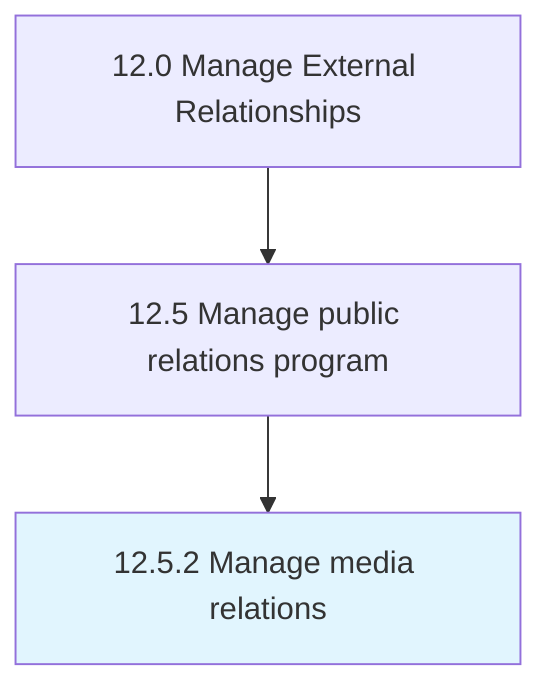

# Manage media relations

> Developing and managing relations with media.

## Overview

Process 12.5.2 is a core process that defines the specific procedures for manage media relations. 

Developing and managing relations with media. Develop connections with journalists to solicit critical, third-party endorsements for a product, issue, service, or organization.

## Process Hierarchy



## Key Statistics

| Metric | Value |
|--------|-------|
| APQC Code | 11067 |
| Hierarchy ID | 12.5.2 |
| Level | Process |
| Parent | [12.5](../) |
| Sub-Processes | 0 |


## GraphDL Semantic Structure

```
manage.MediaRelations
```

| Component | Value | Description |
|-----------|-------|-------------|
| Verb | `manage` | Primary action |
| Object | `media relations` | Direct object |


## Related Concepts

- MediaRelations


---

*Source: APQC PCF 11067 (12.5.2) - APQC*
