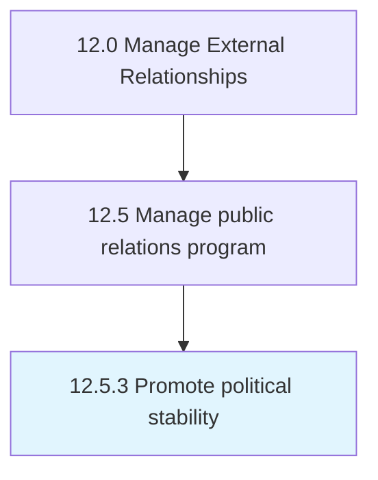

# Promote political stability

> Promoting political security and stability in the regions where the organization conducts business.

## Overview

Process 12.5.3 is a core process that defines the specific procedures for promote political stability. 

Promoting political security and stability in the regions where the organization conducts business. Encourage political stability in the regions where the organization operates. Support civic programs, citizen engagement, connection platforms, etc.

## Process Hierarchy



## Key Statistics

| Metric | Value |
|--------|-------|
| APQC Code | 11068 |
| Hierarchy ID | 12.5.3 |
| Level | Process |
| Parent | [12.5](../) |
| Sub-Processes | 0 |


## GraphDL Semantic Structure

```
promote.PoliticalStability
```

| Component | Value | Description |
|-----------|-------|-------------|
| Verb | `promote` | Primary action |
| Object | `political stability` | Direct object |


## Related Concepts

- [PoliticalStability](/concepts/PoliticalStability)


---

*Source: APQC PCF 11068 (12.5.3) - APQC*
