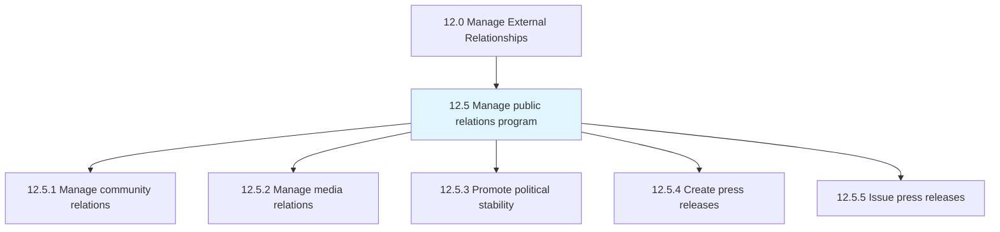
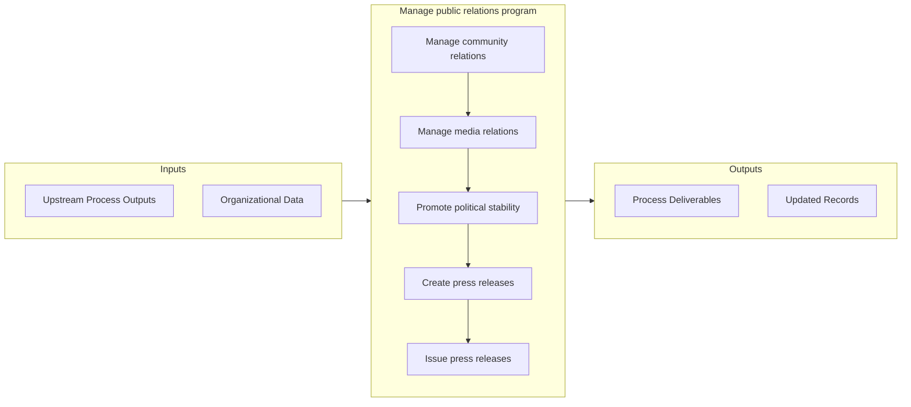

# Manage public relations program

> Managing a public relations programs through business and communications skills.

## Overview

Group 12.5 is a process group within APQC Category 12.0 (Manage External Relationships). 

Managing a public relations programs through business and communications skills.

## Process Hierarchy



## Key Statistics

| Metric | Value |
|--------|-------|
| APQC Code | 11014 |
| Hierarchy ID | 12.5 |
| Level | Group |
| Parent | [12](../) |
| Sub-Processes | 5 |


## GraphDL Semantic Structure

```
manage.PublicRelationsProgram
```

| Component | Value | Description |
|-----------|-------|-------------|
| Verb | `manage` | Primary action |
| Object | `public relations program` | Direct object |


## Process Flow



## Sub-Processes

| Process | Hierarchy ID | Description |
|---------|-------------|-------------|
| [Manage community relations](./ManageCommunityRelations) | 12.5.1 | Developing and administering community relations |
| [Manage media relations](./ManageMediaRelations) | 12.5.2 | Developing and managing relations with media |
| [Promote political stability](./PromotePoliticalStability) | 12.5.3 | Promoting political security and stability in the regions where the organization conducts business |
| [Create press releases](./CreatePressReleases) | 12.5.4 | Developing press releases to communicate developments and generate interest in the organization |
| [Issue press releases](./IssuePressReleases) | 12.5.5 | Issuing press releases to carefully selected media in distribution channels such as the web, newspap |


## Related Concepts

- PublicRelationsProgram


---

*Source: APQC PCF 11014 (12.5) - APQC*
