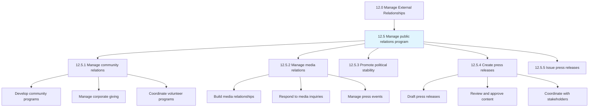
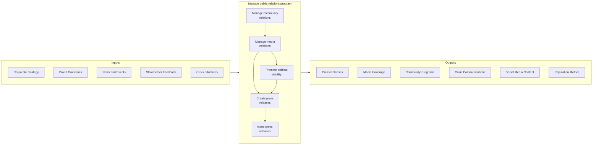
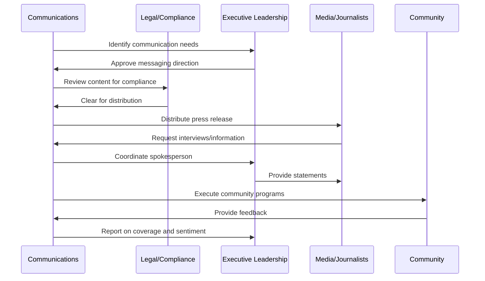
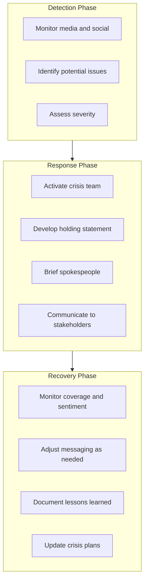
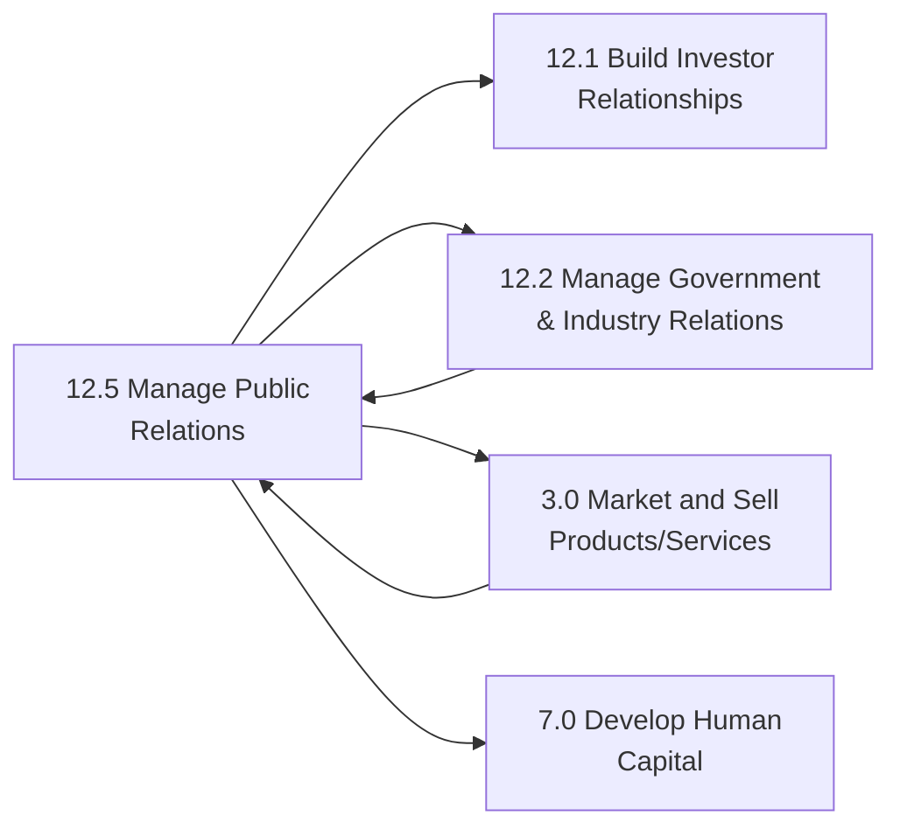

# Manage public relations program

> Managing a public relations programs through business and communications skills.

## Overview

Group 12.5 is a process group within APQC Category 12.0 (Manage External Relationships).

Managing the public relations program is a strategic communications function that shapes how an organization is perceived by its various publics, including customers, communities, media, employees, and the general public. This process group encompasses all activities related to building, maintaining, and protecting the organization's reputation through proactive communication and responsive engagement.

Effective public relations creates positive visibility, builds brand equity, manages crises, and supports business objectives through earned media, community engagement, and stakeholder communication. The function operates at the intersection of corporate strategy, marketing, and external affairs, ensuring consistent messaging across all channels and touchpoints.

Organizations with mature PR capabilities demonstrate stronger brand recognition, better crisis resilience, enhanced employee engagement, and more favorable media coverage. The function has evolved significantly with digital and social media, requiring real-time monitoring, rapid response capabilities, and integrated multi-channel communication strategies.

Key activities include developing communication strategies, managing media relationships, creating and distributing press releases, coordinating community programs, managing social media presence, and responding to reputation threats.

## Process Hierarchy



## Key Statistics

| Metric | Value |
|--------|-------|
| APQC Code | 11014 |
| Hierarchy ID | 12.5 |
| Level | Group |
| Parent | [12.0 Manage External Relationships](../) |
| Sub-Processes | 5 |
| Industry Applicability | All industries |


## GraphDL Semantic Structure

```graphdl
manage.PublicRelationsProgram
```

| Component | Value | Description |
|-----------|-------|-------------|
| Verb | `manage` | Primary action - ongoing oversight and execution |
| Object | `public relations program` | Direct object - the comprehensive PR function |


## Process Flow



## Sub-Processes

| Process | Hierarchy ID | Description |
|---------|-------------|-------------|
| [Manage community relations](./ManageCommunityRelations) | 12.5.1 | Developing and administering community relations programs that build positive relationships with local communities where the organization operates. Includes corporate philanthropy, volunteer programs, community partnerships, and local stakeholder engagement. |
| [Manage media relations](./ManageMediaRelations) | 12.5.2 | Developing and managing relationships with journalists, editors, and media outlets. Includes proactive media outreach, responding to inquiries, organizing press events, and building relationships with key reporters covering the industry. |
| [Promote political stability](./PromotePoliticalStability) | 12.5.3 | Promoting political security and stability in the regions where the organization conducts business. Includes monitoring political developments, engaging with local stakeholders, and supporting initiatives that contribute to stable operating environments. |
| [Create press releases](./CreatePressReleases) | 12.5.4 | Developing press releases to communicate organizational developments and generate interest. Includes drafting content, coordinating with subject matter experts, obtaining approvals, and ensuring compliance with disclosure requirements. |
| [Issue press releases](./IssuePressReleases) | 12.5.5 | Issuing press releases through appropriate distribution channels including wire services, web, newspapers, broadcast media, and social media. Includes timing releases for maximum impact and monitoring pickup and coverage. |

## Activity Sequence



## RACI Matrix

| Activity | Communications | CMO/CCO | CEO | Legal Counsel | Marketing | HR |
|----------|---------------|---------|-----|---------------|-----------|-----|
| Develop PR strategy | R | A | C | C | C | C |
| Create press releases | R | A | C | C | I | I |
| Issue press releases | R | A | I | C | I | I |
| Manage media relations | R | A | C | C | I | I |
| Respond to media inquiries | R | A | C | A | I | I |
| Manage community relations | R | A | C | I | C | C |
| Coordinate corporate giving | R | A | A | I | I | C |
| Manage crisis communications | R | A | A | A | I | C |
| Monitor media coverage | R | A | I | I | C | I |
| Manage social media | R | A | I | C | C | I |
| Develop executive communications | R | A | C | C | I | I |
| Coordinate internal communications | R | A | C | I | I | A |

**Legend:** R = Responsible, A = Accountable, C = Consulted, I = Informed

## Metrics and KPIs

### Effectiveness Metrics

| Metric | Description | Target Range |
|--------|-------------|--------------|
| Media impressions | Total audience reached through earned media | Increasing trend |
| Share of voice | Media coverage vs. competitors | Higher than key competitors |
| Message pull-through | Key messages appearing in coverage | 70%+ of coverage includes key messages |
| Sentiment analysis | Positive/neutral/negative coverage ratio | 70%+ positive/neutral |
| Crisis response time | Time to initial response during crisis | Within 1 hour |

### Efficiency Metrics

| Metric | Description | Target Range |
|--------|-------------|--------------|
| Press release pickup rate | Percentage of releases generating coverage | 60%+ pickup rate |
| Media response time | Time to respond to media inquiries | Within 4 hours |
| Content production cycle | Days to develop and approve press releases | 2-5 business days |
| Cost per impression | PR spend divided by total impressions | Optimize over time |

### Outcome Metrics

| Metric | Description | Target Range |
|--------|-------------|--------------|
| Brand awareness | Aided and unaided brand recognition | Increasing trend |
| Reputation score | External reputation survey results | Top quartile in industry |
| Community favorability | Local community sentiment ratings | 70%+ favorable |
| Employee pride score | Employee sentiment about company reputation | 80%+ positive |
| Award recognition | Industry and community awards received | Regular recognition |

## Related Departments and Occupations

### Primary Departments

| Department | Role in Process |
|------------|-----------------|
| Corporate Communications | Primary owner of all PR activities |
| Marketing | Coordinates on brand messaging and campaigns |
| Legal/Compliance | Reviews communications for legal and regulatory compliance |
| Human Resources | Coordinates on internal communications and culture |
| Executive Office | Provides executive spokespeople and approvals |
| Investor Relations | Coordinates on public company disclosures |

### Key Occupations

| Occupation | Responsibilities |
|------------|------------------|
| Chief Communications Officer | Leads overall communications strategy |
| Public Relations Manager | Manages day-to-day PR operations |
| Media Relations Specialist | Handles media outreach and inquiries |
| Community Relations Manager | Develops and executes community programs |
| Social Media Manager | Manages digital and social channels |
| Crisis Communications Specialist | Leads crisis response efforts |
| Internal Communications Manager | Manages employee communications |

## Communication Channels

| Channel | Use Cases | Key Considerations |
|---------|-----------|-------------------|
| Press releases | Major announcements, financial results, product launches | Formal, regulatory considerations |
| Media interviews | Thought leadership, news commentary | Spokesperson preparation |
| Press conferences | Major news, crisis response | Logistics, media coordination |
| Social media | Real-time engagement, brand personality | Monitoring, rapid response |
| Blogs/Content marketing | Thought leadership, SEO | Quality, consistency |
| Community events | Local engagement, goodwill | Resource allocation |
| Internal channels | Employee communications | Transparency, timing |

## Crisis Communications Framework



## Industry Variations

### Consumer Products

Consumer-facing companies focus heavily on brand reputation, influencer relations, and product publicity. Social media management and consumer sentiment monitoring are critical capabilities.

**Industry-Specific Activities:**
- Manage influencer partnerships
- Coordinate product launches
- Handle consumer complaints publicly
- Build brand communities

### Healthcare

Healthcare organizations navigate HIPAA constraints while building trust with patients and communities. Crisis communications often involve patient safety issues.

**Industry-Specific Activities:**
- Communicate health information responsibly
- Manage patient privacy in communications
- Coordinate with public health officials
- Address clinical quality issues

### Financial Services

Financial institutions focus on trust and stability messaging while navigating strict regulatory disclosure requirements.

**Industry-Specific Activities:**
- Coordinate with investor relations
- Manage regulatory announcements
- Build trust through transparency
- Address financial inclusion

### Technology

Tech companies manage rapid news cycles, product launches, and increasingly complex issues around privacy, AI, and platform responsibility.

**Industry-Specific Activities:**
- Manage product launches at scale
- Address privacy and data concerns
- Navigate platform responsibility issues
- Build developer and user communities

## Related Processes



## Related Concepts

- PublicRelationsProgram
- MediaRelations
- CommunityRelations
- CrisisCommunications
- CorporateCommunications
- BrandReputation
- StakeholderEngagement


---

*Source: APQC PCF 11014 (12.5) - APQC*
