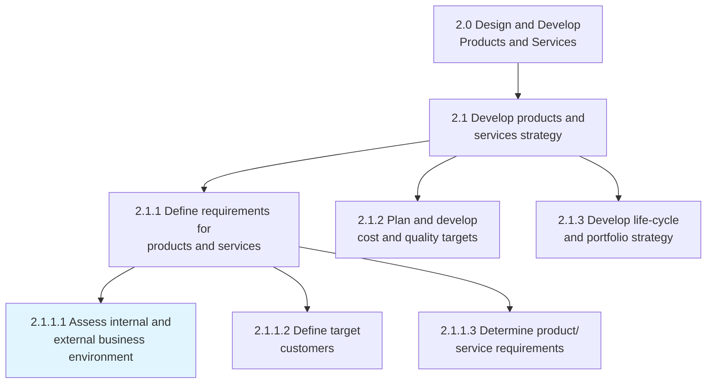
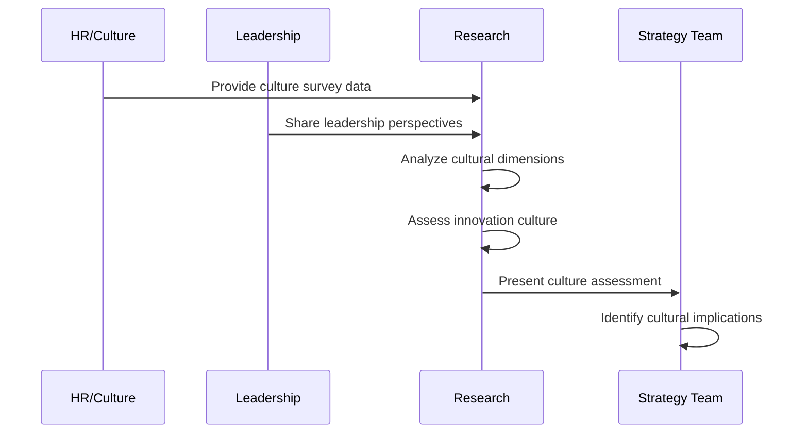
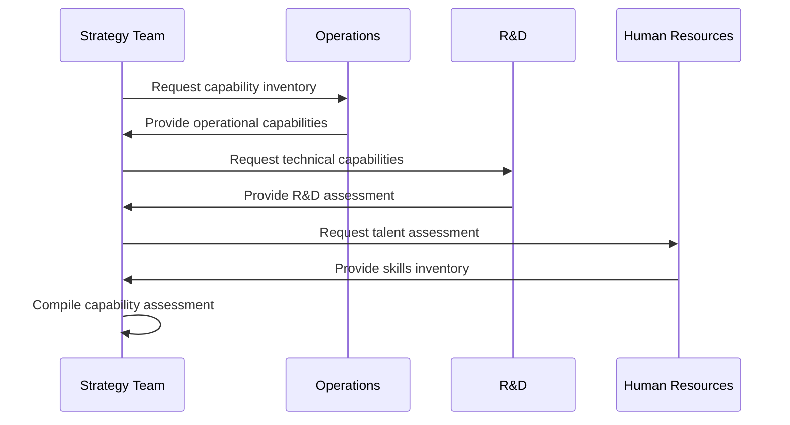
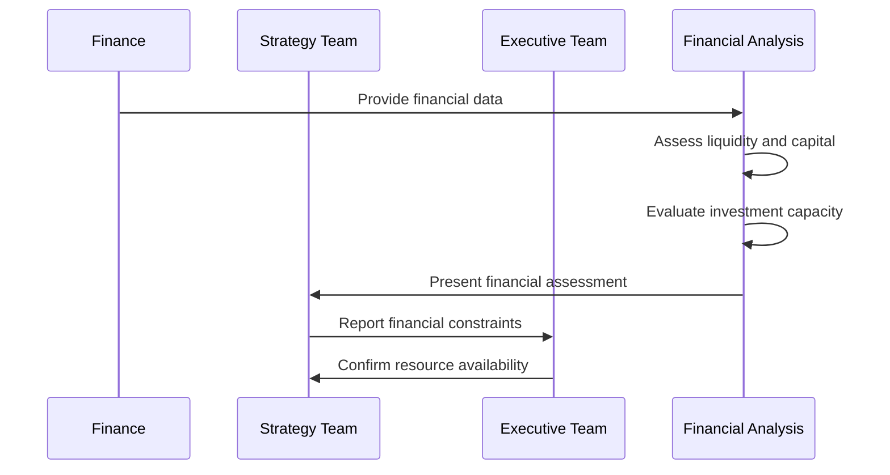
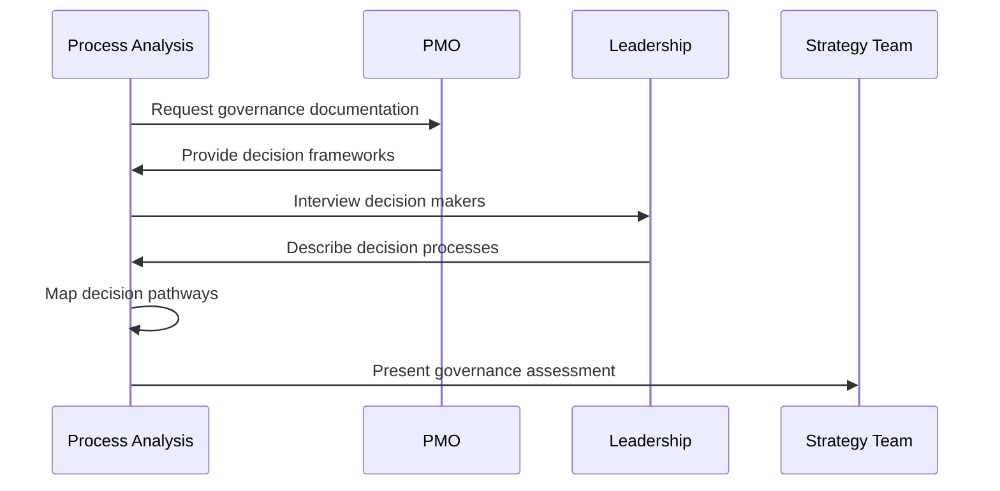
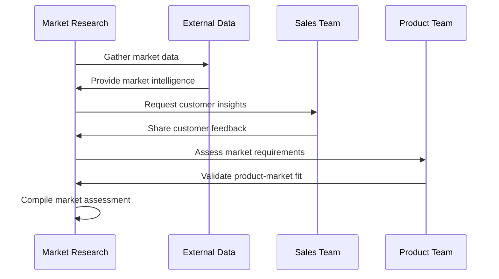
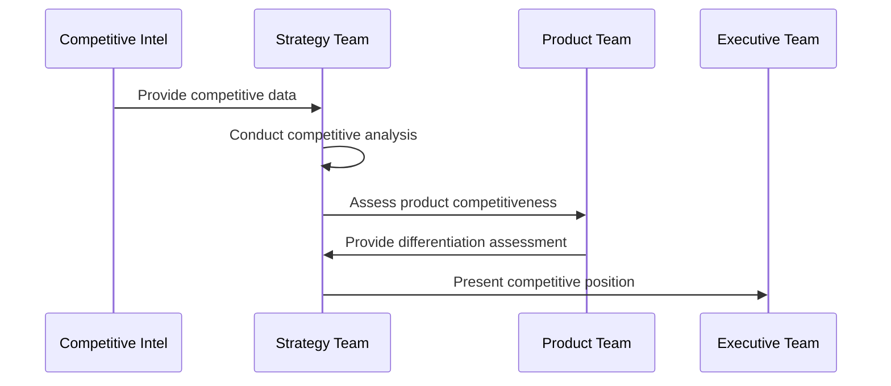
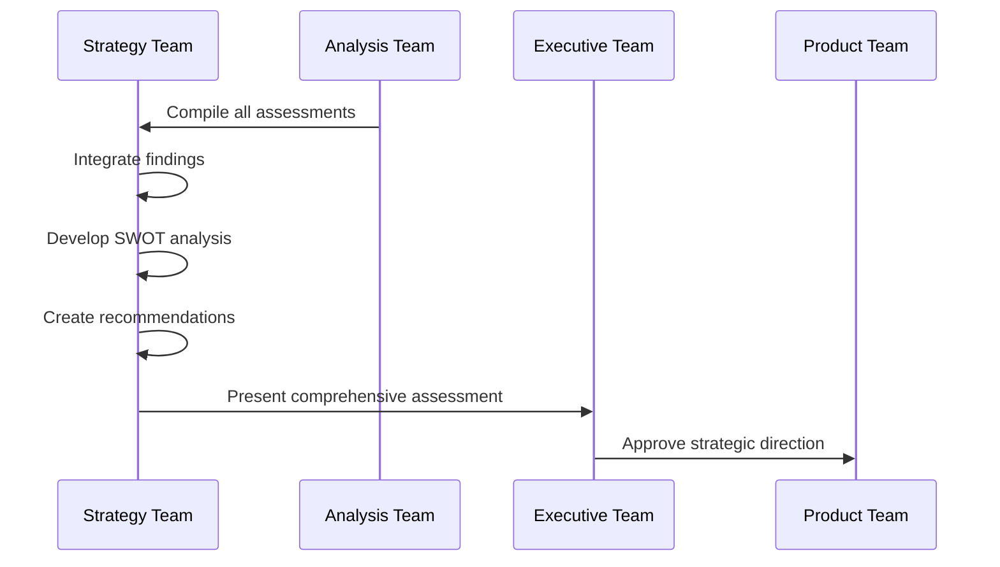
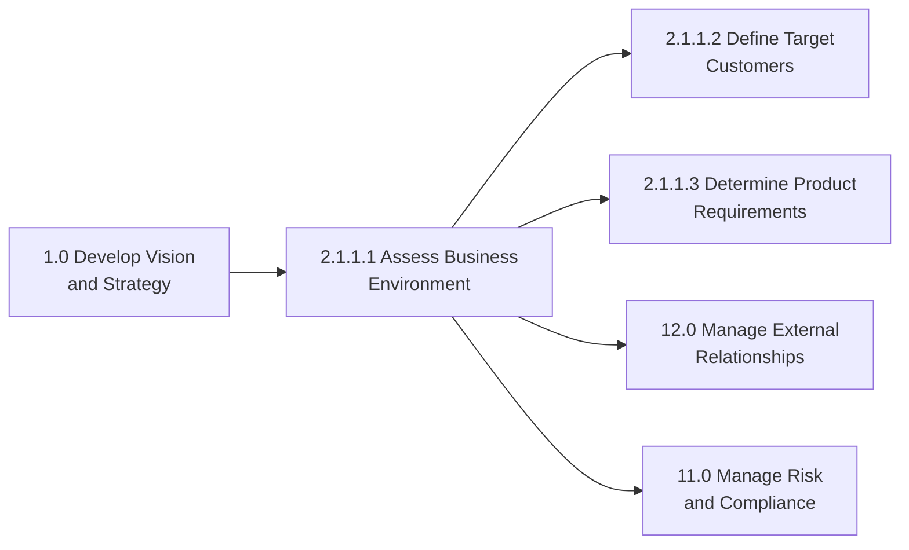

# Assess internal and external business environment

> Understanding the culture and environment in which you're operating. Analyze how internal decision-making, thought processes, financial circumstances, and more affect the ability to bring new products to market. Survey or analyze the market into which the products would be introduced.

## Overview

Assess internal and external business environment (APQC 2.1.1.1) is an activity within the "Develop products and services strategy" process. This comprehensive assessment examines both internal organizational factors (culture, capabilities, resources, decision-making processes) and external market conditions to inform product development and business decisions.

The process bridges strategic planning and operational execution by providing a holistic view of the business context. It identifies constraints and opportunities that affect the organization's ability to innovate, compete, and deliver value. This assessment is foundational for product strategy, market entry decisions, and external relationship management.

## Process Hierarchy



## Key Statistics

| Metric | Value |
|--------|-------|
| APQC Code | 10113 |
| Hierarchy ID | 2.1.1.1 |
| Level | Activity |
| Category | [Design and Develop Products and Services](/processes/02-Products) |
| Parent Process | [Define requirements for products and services](./index.mdx) |

## Process Flow

```mermaid
flowchart LR
    subgraph Inputs["Inputs"]
        I1["Strategic Plans"]
        I2["Financial Data"]
        I3["Organizational Capabilities"]
        I4["Market Research"]
        I5["Competitive Intelligence"]
        I6["Customer Feedback"]
    end

    subgraph Process["Assess Business Environment"]
        P1["Analyze Internal<br/>Culture"]
        P2["Assess Organizational<br/>Capabilities"]
        P3["Evaluate Financial<br/>Position"]
        P4["Analyze Decision-Making<br/>Processes"]
        P5["Survey External<br/>Market"]
        P6["Assess Competitive<br/>Position"]
        P7["Synthesize<br/>Assessment"]

        P1 --> P7
        P2 --> P7
        P3 --> P7
        P4 --> P7
        P5 --> P7
        P6 --> P7
    end

    subgraph Outputs["Outputs"]
        O1["Business Environment Report"]
        O2["SWOT Analysis"]
        O3["Capability Assessment"]
        O4["Market Opportunity Analysis"]
        O5["Strategic Recommendations"]
        O6["Risk Assessment"]
    end

    Inputs --> Process --> Outputs
```



## GraphDL Semantic Structure

```
assess.BusinessEnvironment.for.ProductStrategy
```

| Component | Value | Description |
|-----------|-------|-------------|
| Verb | `assess` | Primary action of evaluating and analyzing |
| Object | `BusinessEnvironment` | Internal and external business context |
| Preposition | `for` | Purpose of the assessment |
| PrepObject | `ProductStrategy` | Informing product development decisions |

## Activities

### Analyze internal culture

Evaluating the organizational culture, values, and behavioral norms that influence business decisions and innovation capacity.



**Tasks:**
- `assess.OrganizationalCulture` - Evaluate cultural values and norms
- `analyze.InnovationReadiness` - Assess openness to change
- `evaluate.RiskTolerance` - Determine organizational risk appetite
- `identify.CulturalBarriers` - Find obstacles to product development

### Assess organizational capabilities

Evaluating the skills, resources, and competencies available to execute on product and business strategies.



**Tasks:**
- `inventory.Capabilities` - Catalog organizational competencies
- `assess.TechnicalCapabilities` - Evaluate technical skills and tools
- `evaluate.OperationalCapacity` - Determine production capabilities
- `identify.CapabilityGaps` - Find missing competencies

### Evaluate financial position

Analyzing the financial health and resource availability that affects investment capacity and business decisions.



**Tasks:**
- `analyze.FinancialHealth` - Assess financial stability
- `evaluate.InvestmentCapacity` - Determine available capital
- `assess.CashFlowPosition` - Analyze cash flow dynamics
- `identify.FinancialConstraints` - Find financial limitations

### Analyze decision-making processes

Understanding how decisions are made within the organization and their impact on speed-to-market and innovation.



**Tasks:**
- `map.DecisionProcesses` - Document decision workflows
- `assess.DecisionSpeed` - Evaluate time to decisions
- `evaluate.Governance` - Analyze approval structures
- `identify.Bottlenecks` - Find decision-making obstacles

### Survey external market

Analyzing market conditions, customer needs, and competitive dynamics that affect product success.



**Tasks:**
- `analyze.MarketConditions` - Evaluate market dynamics
- `assess.CustomerNeeds` - Understand customer requirements
- `evaluate.MarketTrends` - Identify market directions
- `identify.MarketOpportunities` - Find growth opportunities

### Assess competitive position

Evaluating the organization's position relative to competitors and identifying competitive advantages and threats.



**Tasks:**
- `analyze.CompetitiveLandscape` - Map competitive environment
- `assess.CompetitiveAdvantages` - Identify differentiators
- `evaluate.CompetitiveThreats` - Determine competitive risks
- `benchmark.Performance` - Compare against competitors

### Synthesize assessment

Integrating all internal and external findings into a comprehensive business environment assessment.



**Tasks:**
- `integrate.Assessments` - Combine internal and external findings
- `develop.SWOTAnalysis` - Create strengths/weaknesses/opportunities/threats
- `create.Recommendations` - Develop strategic recommendations
- `communicate.Findings` - Present assessment to stakeholders

## RACI Matrix

| Activity | Responsible | Accountable | Consulted | Informed |
|----------|-------------|-------------|-----------|----------|
| Analyze internal culture | HR/OD Team | CHRO | Leadership | All Employees |
| Assess capabilities | Strategy Team | COO | All Departments | Executive Team |
| Evaluate financial position | Finance Team | CFO | Strategy | Executive Team |
| Analyze decision processes | Process Team | COO | Leadership | PMO |
| Survey external market | Market Research | CMO | Sales, Product | Executive Team |
| Assess competitive position | Strategy Team | CSO | Marketing, Sales | Board |
| Synthesize assessment | Strategy Team | CEO | Executive Team | All Stakeholders |

## Related Departments

- [Strategy & Planning](/departments/Strategy) - Primary ownership of environment assessment
- [Finance](/departments/Finance) - Financial analysis
- [Marketing](/departments/Marketing) - Market research and competitive intelligence
- [Human Resources](/departments/HR) - Culture and capability assessment
- [Product Management](/departments/Product) - Product-market fit analysis

## Related Occupations

- [Management Analysts](/occupations/ManagementAnalysts) - Business environment analysis
- [Market Research Analysts](/occupations/MarketResearchAnalysts) - Market assessment
- [Financial Analysts](/occupations/FinancialAnalysts) - Financial position analysis
- [Product Managers](/occupations/ProductManagers) - Product strategy implications
- [Strategic Planners](/occupations/StrategicPlanners) - Strategic synthesis

## Industry Variations

### Aerospace and Defense

Business environment assessment in aerospace emphasizes long-term government budget cycles, technology development timelines, and regulatory certification pathways that affect product development.

**Industry-Specific Activities:**
- Assess defense budget outlook and priorities
- Evaluate technology readiness levels (TRL)
- Analyze regulatory certification requirements
- Assess prime contractor relationships

### Banking

Banking environment assessment focuses on regulatory capital requirements, interest rate environment, digital transformation readiness, and fintech competitive pressures.

**Industry-Specific Activities:**
- Assess regulatory capital position
- Evaluate digital transformation capabilities
- Analyze interest rate sensitivity
- Assess fintech partnership opportunities

### Automotive

Automotive companies assess electrification transition capabilities, manufacturing flexibility, supplier relationships, and regulatory emissions compliance.

**Industry-Specific Activities:**
- Evaluate EV development capabilities
- Assess manufacturing flexibility
- Analyze supplier ecosystem health
- Evaluate emissions compliance position

### Healthcare Provider

Healthcare organizations assess clinical capabilities, payer relationships, regulatory compliance position, and population health management readiness.

**Industry-Specific Activities:**
- Assess clinical service capabilities
- Evaluate payer contract positions
- Analyze regulatory compliance status
- Assess population health infrastructure

### Retail

Retailers assess omnichannel capabilities, supply chain resilience, customer data assets, and real estate portfolio positioning.

**Industry-Specific Activities:**
- Evaluate omnichannel integration
- Assess supply chain capabilities
- Analyze customer data infrastructure
- Evaluate store portfolio optimization

### City Government

City governments assess internal capabilities, budget constraints, citizen service delivery, and regional competitive position for economic development.

**Industry-Specific Activities:**
- Assess departmental capabilities
- Evaluate fiscal health and constraints
- Analyze service delivery effectiveness
- Assess economic development competitiveness

### Education

Educational institutions assess teaching capabilities, technology infrastructure, accreditation status, and enrollment competitive position.

**Industry-Specific Activities:**
- Evaluate instructional capabilities
- Assess technology infrastructure
- Analyze accreditation compliance
- Evaluate enrollment competition

### Consumer Products

Consumer products companies assess brand portfolio strength, innovation pipeline, retail partnerships, and supply chain agility.

**Industry-Specific Activities:**
- Evaluate brand equity positions
- Assess innovation capabilities
- Analyze retailer relationships
- Evaluate supply chain responsiveness

## Sub-Processes

| Process | Code | Description |
|---------|------|-------------|
| Analyze internal culture | - | Evaluate organizational culture |
| Assess capabilities | - | Inventory organizational competencies |
| Evaluate financial position | - | Analyze financial health |
| Analyze decision processes | - | Map governance and decision workflows |
| Survey external market | - | Research market conditions |
| Assess competitive position | - | Evaluate competitive standing |
| Synthesize assessment | - | Integrate all findings |

## Related Processes



## Metrics & KPIs

| Metric | Description | Target |
|--------|-------------|--------|
| Assessment Coverage | Completeness of internal/external analysis | >95% |
| Assessment Currency | Freshness of environment data | <90 days |
| Capability Gap Identification | Gaps identified before project impact | >80% |
| Market Opportunity Capture | Opportunities identified vs realized | >60% |
| Decision Quality | Decisions informed by assessment | >90% |
| Stakeholder Satisfaction | Satisfaction with assessment usefulness | >85% |

---

*Source: APQC PCF 10113 (2.1.1.1) - Cross-Industry*
