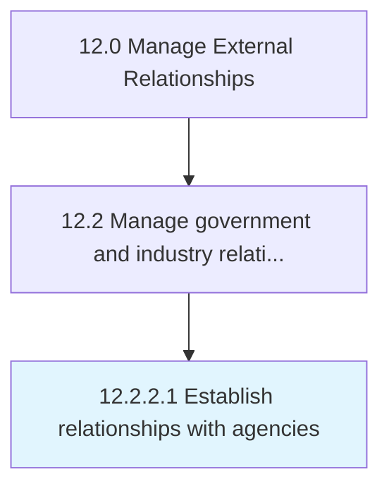

# Establish relationships with agencies

> Engaging government, regulatory, or industry agencies to establish relationships.

## Overview

Activity 12.2.2.1 is an activity within the Manage External Relationships framework. 

Engaging government, regulatory, or industry agencies to establish relationships. Analyze steps and requirements necessary for inclusion, if needed.

## Process Hierarchy



## Key Statistics

| Metric | Value |
|--------|-------|
| APQC Code | 12875 |
| Hierarchy ID | 12.2.2.1 |
| Level | Activity |
| Parent | [12.2.2](../) |
| Sub-Processes | 0 |


## GraphDL Semantic Structure

```
establish.Relationships.with.Agencies
```

| Component | Value | Description |
|-----------|-------|-------------|
| Verb | `establish` | Primary action |
| Object | `relationships` | Direct object |
| Preposition | `with` | Relationship |
| PrepObject | `agencies` | Indirect object |


## Related Concepts

- [Relationships](/concepts/Relationships)
- [Agencies](/concepts/Agencies)


---

*Source: APQC PCF 12875 (12.2.2.1) - APQC*
