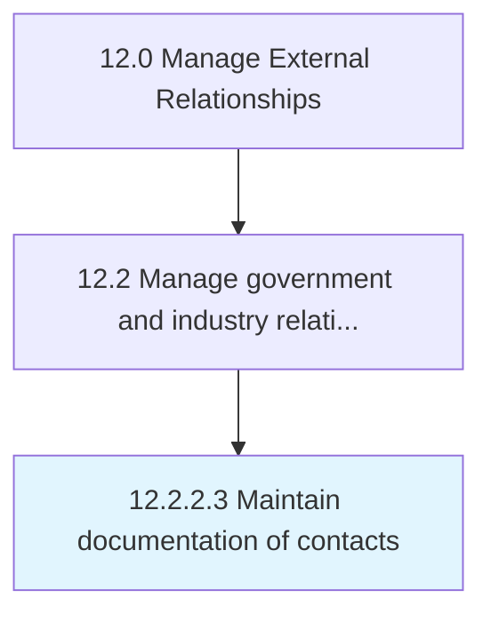

# Maintain documentation of contacts

> Keeping a repository of documents that contain information about the network of partners, prospects and customers.

## Overview

Activity 12.2.2.3 is an activity within the Manage External Relationships framework. 

Keeping a repository of documents that contain information about the network of partners, prospects and customers. Keep records up-to-date with routine reviews and modify as needed.

## Process Hierarchy



## Key Statistics

| Metric | Value |
|--------|-------|
| APQC Code | 12877 |
| Hierarchy ID | 12.2.2.3 |
| Level | Activity |
| Parent | [12.2.2](../) |
| Sub-Processes | 0 |


## GraphDL Semantic Structure

```
maintain.Documentation.of.Contacts
```

| Component | Value | Description |
|-----------|-------|-------------|
| Verb | `maintain` | Primary action |
| Object | `documentation` | Direct object |
| Preposition | `of` | Relationship |
| PrepObject | `contacts` | Indirect object |


## Related Concepts

- Documentation
- Contacts


---

*Source: APQC PCF 12877 (12.2.2.3) - APQC*
