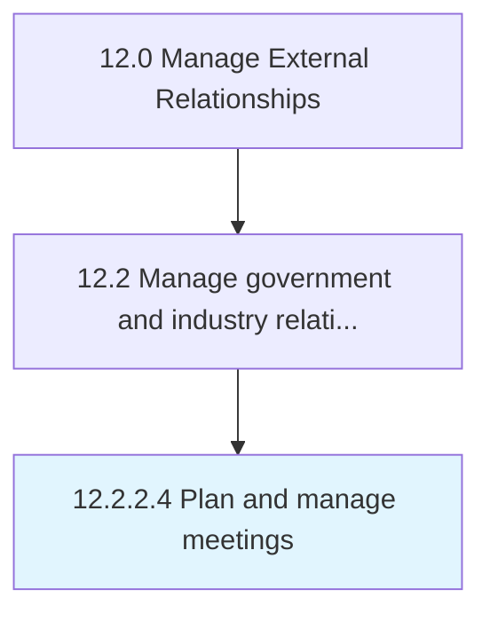

# Plan and manage meetings

> Ensuring regular interaction between business entity and quasi-government bodies in order to maintain established relationships.

## Overview

Activity 12.2.2.4 is an activity within the Manage External Relationships framework. 

Ensuring regular interaction between business entity and quasi-government bodies in order to maintain established relationships. Collect and record meeting data for further analysis and use.

## Process Hierarchy



## Key Statistics

| Metric | Value |
|--------|-------|
| APQC Code | 12878 |
| Hierarchy ID | 12.2.2.4 |
| Level | Activity |
| Parent | [12.2.2](../) |
| Sub-Processes | 0 |


## GraphDL Semantic Structure

```
plan.AndManageMeetings
```

| Component | Value | Description |
|-----------|-------|-------------|
| Verb | `plan` | Primary action |
| Object | `and manage meetings` | Direct object |


## Related Concepts

- Meetings
- Meetings


---

*Source: APQC PCF 12878 (12.2.2.4) - APQC*
