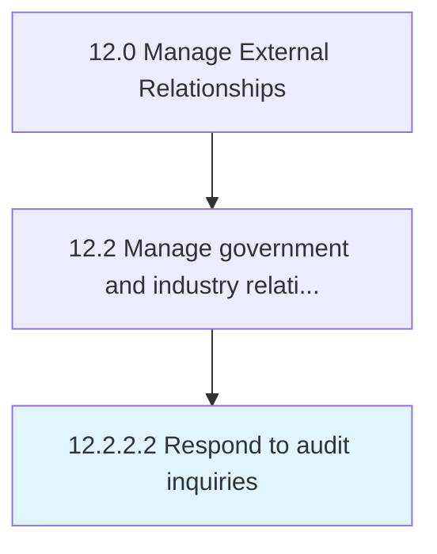

# Respond to audit inquiries

> Cooperating with auditors regarding potential or ongoing inquiries.

## Overview

Activity 12.2.2.2 is an activity within the Manage External Relationships framework. 

Cooperating with auditors regarding potential or ongoing inquiries.

## Process Hierarchy



## Key Statistics

| Metric | Value |
|--------|-------|
| APQC Code | 12876 |
| Hierarchy ID | 12.2.2.2 |
| Level | Activity |
| Parent | [12.2.2](../) |
| Sub-Processes | 0 |


## GraphDL Semantic Structure

```
respond.ToAuditInquiries
```

| Component | Value | Description |
|-----------|-------|-------------|
| Verb | `respond` | Primary action |
| Object | `to audit inquiries` | Direct object |


## Related Concepts

- AuditInquiries


---

*Source: APQC PCF 12876 (12.2.2.2) - APQC*
