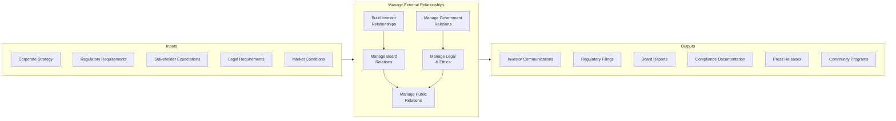
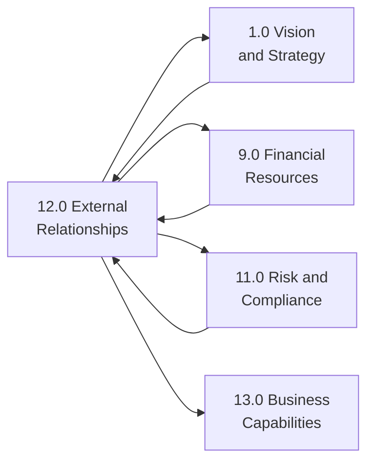

# Manage External Relationships

> Fostering external relationships with stakeholders of the entity, including investors, government and industry, the board of directors, and the general public. This category encompasses all activities related to managing relationships outside the traditional customer-supplier paradigm.

## Overview

APQC Category 12.0 - Manage External Relationships is a critical process category that encompasses all activities related to building and maintaining relationships with stakeholders beyond customers and suppliers. This category provides the framework for investor relations, government affairs, board management, legal compliance, and public relations.

Organizations use these processes to ensure transparent communication with shareholders, comply with regulatory requirements, maintain positive community relations, and protect their corporate reputation. Effective external relationship management is essential for sustainable business operations and long-term organizational success.

## Process Hierarchy

```mermaid
graph TD
    C12["12.0 Manage External Relationships"] --> G121["12.1 Build investor relationships"]
    C12 --> G122["12.2 Manage government and<br/>industry relationships"]
    C12 --> G123["12.3 Manage relations with<br/>board of directors"]
    C12 --> G124["12.4 Manage legal and<br/>ethical issues"]
    C12 --> G125["12.5 Manage public<br/>relations program"]

    G121 --> P1211["12.1.1 Plan, build, and manage<br/>lender relations"]
    G121 --> P1212["12.1.2 Plan, build, and manage<br/>analyst relations"]
    G121 --> P1213["12.1.3 Communicate with shareholders"]

    G122 --> P1221["12.2.1 Manage government relations"]
    G122 --> P1222["12.2.2 Manage relations with<br/>quasi-government bodies"]
    G122 --> P1223["12.2.3 Manage relations with<br/>trade or industry groups"]
    G122 --> P1224["12.2.4 Manage lobby activities"]

    G124 --> P1241["12.4.1 Create ethics policies"]
    G124 --> P1242["12.4.2 Manage corporate<br/>governance policies"]
    G124 --> P1243["12.4.3 Ensure compliance"]
    G124 --> P1244["12.4.4 Manage outside counsel"]
    G124 --> P1245["12.4.5 Protect intellectual property"]
    G124 --> P1246["12.4.6 Resolve disputes<br/>and litigations"]

    G125 --> P1251["12.5.1 Manage community relations"]
    G125 --> P1252["12.5.2 Manage media relations"]
    G125 --> P1253["12.5.3 Promote political stability"]
```

## Key Statistics

| Metric | Value |
|--------|-------|
| APQC Code | 10012 |
| Hierarchy ID | 12.0 |
| Level | Category |
| Process Groups | 5 |
| Total Processes | 50+ |

## Process Flow

## Processes in this Category

### 12.1 Build investor relationships

Creating strategic management responsibility for integrating finance, communication, marketing, and securities law compliance. Enable effective two-way communication among the organization, the financial community, and other constituencies.

- [Communicate strategies internally and externally](./StrategyComms.mdx) - Conveying planned procedures to stakeholders
- [Assess internal and external business environment](./BusinessEnvironment.mdx) - Understanding operating context

### 12.2 Manage government and industry relationships

Creating and maintaining relationships with government and industry representatives.

- [Assess the external environment](./ExternalEnvironment.mdx) - Process 1.1.1 - Analyzing external forces

### 12.3 Manage relations with board of directors

Maintaining relations with representatives of the stockholders to establish corporate management-related policies.

### 12.4 Manage legal and ethical issues

Managing legal practices to abide by the law, as well as ethical practices.

- [Conduct mandatory and elective external reviews](./ExternalReviews.mdx) - External compliance reviews
- [Liaise with external certification authorities](./Certifications.mdx) - Coordinating certifications

### 12.5 Manage public relations program

Managing public relations programs through business and communications skills.

## Related Categories

## RACI Matrix

| Activity | Responsible | Accountable | Consulted | Informed |
|----------|-------------|-------------|-----------|----------|
| Build investor relations | Investor Relations | CFO | CEO, Legal | Board |
| Manage government relations | Government Affairs | CEO | Legal, Public Policy | Executive Team |
| Manage board relations | Corporate Secretary | CEO | Legal | Executive Team |
| Manage legal issues | General Counsel | CEO | External Counsel | Board |
| Manage public relations | Communications | CMO | Marketing, HR | All Departments |

## Industry Variations

### Banking

Banking institutions face extensive regulatory oversight requiring specialized government relations and compliance management. Investor relations must address unique capital requirements and risk disclosures.

**Industry-Specific Activities:**
- Manage regulatory examinations
- Coordinate with banking regulators
- Communicate capital adequacy to investors

### Healthcare Provider

Healthcare organizations must navigate complex regulatory environments including CMS, state health departments, and accreditation bodies while maintaining community trust.

**Industry-Specific Activities:**
- Manage relationships with health regulators
- Coordinate with accreditation organizations
- Maintain community health partnerships

### Aerospace and Defense

Defense contractors manage extensive government relationships as their primary customers while navigating classified information requirements and export controls.

**Industry-Specific Activities:**
- Manage defense agency relationships
- Navigate security clearance requirements
- Coordinate with international defense ministries

---

*Source: APQC PCF Category 12.0 - Cross-Industry*
