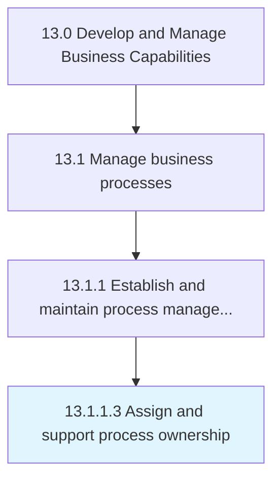

# Assign and support process ownership

> Assigning resources (employees) ownership of tasks.

## Overview

Activity 13.1.1.3 is an activity within the Develop and Manage Business Capabilities framework. 

Assigning resources (employees) ownership of tasks. These include the responsibility of identifying, analyzing, and improving business processes in order to meet the goals and objectives such as increasing profits and performance, reducing costs, and accelerating schedules.

## Process Hierarchy



## Key Statistics

| Metric | Value |
|--------|-------|
| APQC Code | 16382 |
| Hierarchy ID | 13.1.1.3 |
| Level | Activity |
| Parent | [13.1.1](../) |
| Sub-Processes | 0 |


## GraphDL Semantic Structure

```
assign.AndSupportProcessOwnership
```

| Component | Value | Description |
|-----------|-------|-------------|
| Verb | `assign` | Primary action |
| Object | `and support process ownership` | Direct object |


## Related Concepts

- [ProcessOwnership](/concepts/ProcessOwnership)
- [ProcessOwnership](/concepts/ProcessOwnership)


---

*Source: APQC PCF 16382 (13.1.1.3) - APQC*
